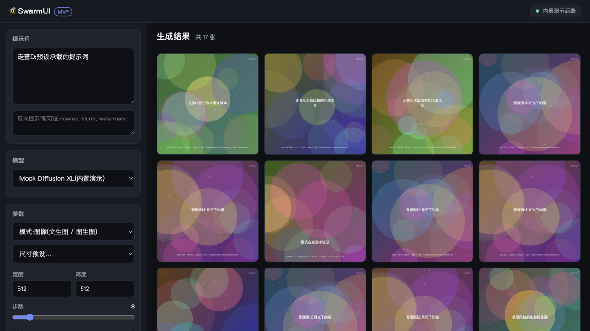
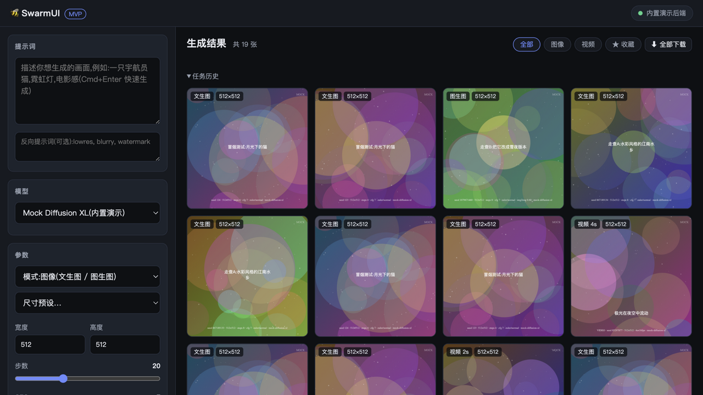
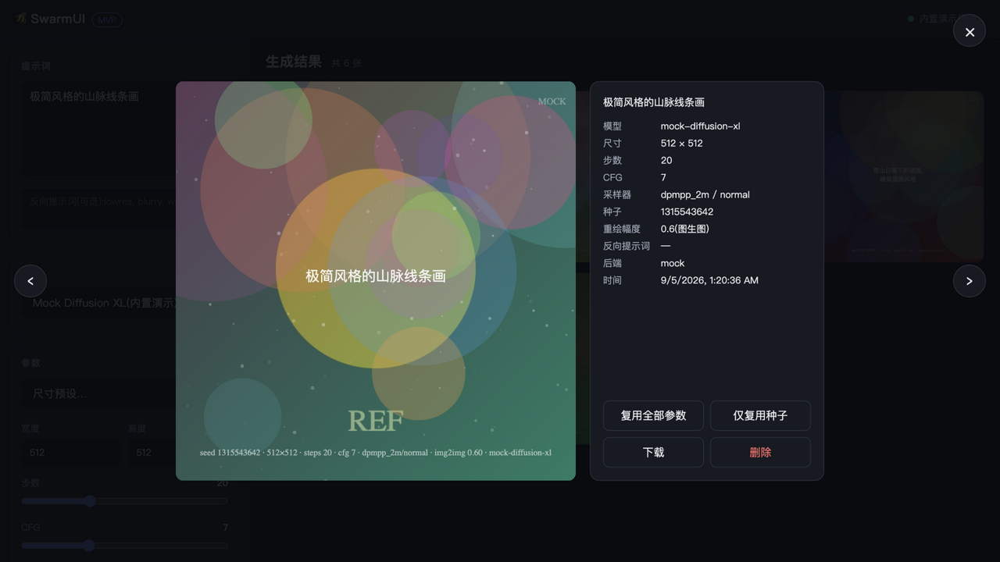

<div align="center">

# 🐝 SwarmUI MVP

**SwarmUI 风格的 AI 图像 / 视频生成 Web 应用 · 零配置开箱即用 · 一键切换 ComfyUI 真实出图**

[](https://github.com/weilengdezaoshang/aiVideo/actions/workflows/ci.yml)
[](LICENSE)
[](https://nodejs.org/)
[](https://www.typescriptlang.org/)

文生图 / 图生图 / 图生视频 · 任务队列 · 实时进度 · 收藏与过滤 · 参数预设 · 历史持久化

</div>

---

## 📸 界面预览

| 主界面(网格 + 参数面板) | 工具栏(过滤 / 收藏 / 批量下载) |
| --- | --- |
|  |  |

| 灯箱(完整生成参数 + 复用 / 下载) |
| --- |
|  |

> 截图为内置 Mock 后端的演示效果;切换 ComfyUI 后界面不变,产出真实图片。

## ✨ 功能特性

- **三种生成模式** —— 文生图、图生图(上传 / 拖入参考图 + 重绘幅度)、图生视频(参考图作首帧,演示链路)
- **完整参数** —— 模型、尺寸预设、步数、CFG、采样器 / 调度器、种子(随机或固定)、批量 1~16
- **任务队列** —— FIFO 调度,按后端并发能力执行;实时进度条(SSE 推送)、随时取消、失败后一键重试
- **结果管理** —— 网格视图 / 灯箱大图、类型过滤(图像 / 视频 / 收藏)、星标收藏(豁免历史裁剪)、单张或批量下载、删除
- **参数预设** —— 当前参数保存为命名预设(localStorage),一键载入 / 删除
- **任务历史** —— 最近任务状态一览(状态点 + 重试入口)
- **持久化** —— 图片与历史落盘(`data/`),重启不丢;上限 500 条自动裁剪
- **健壮性** —— 参数校验、统一 JSON 错误、队列上限保护、优雅停机、结构化日志
- **双后端** —— 内置 Mock(零依赖演示)+ ComfyUI(真实出图),Provider 抽象可扩展任意后端

## 🚀 快速开始

```bash
git clone https://github.com/weilengdezaoshang/aiVideo.git
cd aiVideo
npm install
npm run dev
```

打开 <http://127.0.0.1:7801>,输入提示词,点击「✨ 生成」—— 内置 Mock 后端无需 GPU 即可体验完整流程。

### Docker

```bash
docker compose up -d app                        # 仅应用
docker compose --profile comfy up -d            # 应用 + ComfyUI
```

### 切换 ComfyUI 真实出图

1. 本地启动 [ComfyUI](https://github.com/comfyanonymous/ComfyUI)(默认 `http://127.0.0.1:8188`)并放置 checkpoint 模型;
2. 修改 `config.json`:

```json
{ "provider": "comfyui", "comfyUrl": "http://127.0.0.1:8188", "port": 7801 }
```

3. 重启服务 —— 模型与采样器列表自动从 ComfyUI 读取,生成真实图片。

也可用环境变量覆盖:`SWARMUI_PROVIDER` / `SWARMUI_COMFY_URL` / `SWARMUI_PORT`。

## 📡 API 一览

| 方法 | 路径 | 说明 |
| --- | --- | --- |
| GET | `/api/health` | 服务与后端状态 |
| GET | `/api/models` | 模型列表(来自 provider) |
| GET | `/api/samplers` | 可用采样器与调度器 |
| POST | `/api/generate` | 提交生成任务(202 + jobId);`initImage` 可选 data URL |
| GET | `/api/jobs` | 进行中任务;`?all=1` 返回最近任务历史 |
| GET | `/api/jobs/:id` | 单个任务状态 |
| DELETE | `/api/jobs/:id` | 取消任务 |
| GET | `/api/history?limit=100` | 历史记录(新 → 旧) |
| PUT | `/api/images/:id/star` | 设置 / 取消收藏 |
| DELETE | `/api/images/:id` | 删除图片与记录 |
| GET | `/api/events` | SSE 实时事件(snapshot / job / image) |

```bash
curl -X POST http://127.0.0.1:7801/api/generate \
  -H 'Content-Type: application/json' \
  -d '{"prompt":"一只宇航员猫, 霓虹灯","model":"mock-diffusion-xl","steps":20,"batchCount":2}'
```

## 🏗️ 项目结构

```
aiVideo/
├── config.json                  # 运行配置(provider / comfyUrl / port)
├── docker-compose.yml           # 应用 + ComfyUI 编排(免构建挂载源码)
├── scripts/
│   └── e2e-smoke.mjs            # 端到端冒烟脚本(零依赖,13 项核心流程检查)
├── src/
│   ├── server.ts                # Express 入口:REST + SSE + 静态资源 + 错误处理 + 优雅停机
│   ├── logger.ts                # 结构化日志(LOG_LEVEL 控制)
│   ├── validate.ts              # 生成参数 / 参考图校验与规范化
│   ├── store.ts                 # 图片文件 + 历史持久化(收藏豁免裁剪)
│   ├── types.ts                 # 领域类型(GenParams / Job / ImageRecord …)
│   └── services/
│       ├── job-manager.ts       # FIFO 任务队列:调度 / 进度 / 取消 / 事件 / 媒体类型路由
│       └── providers/
│           ├── provider.ts      # 生成后端抽象接口(图像 + 视频)
│           ├── mock-provider.ts # 内置演示后端(静态 SVG / 动画 SVG 占位产物)
│           └── comfyui-provider.ts  # ComfyUI HTTP 对接(工作流构造 / 上传 / 轮询 / 取图)
├── web/                         # 前端(原生 HTML/CSS/JS,无构建步骤)
│   ├── index.html
│   ├── style.css
│   └── app.js                   # 状态管理 / SSE 渲染 / 灯箱 / 预设 / 过滤
├── tests/                       # node:test 单元测试(27 个)
└── docs/screenshots/            # 界面截图
```

**核心数据流**:

```
浏览器 ──POST /api/generate──▶ JobManager ──FIFO 队列──▶ GenerationProvider
   ▲                                │                      │  Mock / ComfyUI
   └── SSE 实时渲染 ◀─ job/image 事件 ┘        产物字节 ──▶ Store 落盘 + 历史
```

新增后端只需实现 `GenerationProvider` 接口(`status / listModels / listSamplerOptions /
generate / generateVideo`)并在 `server.ts` 注册,队列、API、前端零改动。

## 🧪 测试与校验

```bash
npm run verify          # typecheck + eslint + 单元测试(提交前必跑,pre-commit 自动执行)
node scripts/e2e-smoke.mjs   # 对运行中的服务执行 13 项端到端检查
npm run format          # prettier 统一格式
```

CI(GitHub Actions)在每次 push / PR 时自动执行 `npm ci && npm run verify`。

## 🗺️ Roadmap / TODO

- [x] 核心流程:提示词 → 队列 → 生成 → 网格 → 灯箱 → 历史持久化
- [x] 采样器 / 调度器选择(选项来自后端能力探测)
- [x] 图生图(参考图上传 + 重绘幅度)
- [x] 图生视频 Mock 链路(动画占位产物,前端播放支持)
- [x] 收藏 / 过滤 / 批量下载 / 任务历史 / 失败重试
- [x] 工程化:verify 门禁、husky、CI、Docker、e2e 冒烟脚本
- [ ] **ComfyUI 真实出图验证** —— 在真实环境校准 txt2img / img2img 工作流与超时参数
- [ ] **ComfyUI 图生视频工作流** —— Wan2.2-I2V / LTX-Video 接入(接口已预留 `generateVideo`)
- [ ] 局部重绘(Inpainting)—— 前端蒙版画板 + mask 工作流
- [ ] 指令式图片编辑 —— 接入 Qwen-Image-Edit / FLUX.1 Kontext
- [ ] LoRA / ControlNet 支持
- [ ] 云端 GPU 部署指南(AutoDL / RunPod)
- [x] 历史搜索与参数过滤(关键字 / 模型 / 类型 / 收藏)
- [ ] 历史标签管理
- [ ] 多语言界面(i18n)

> 欢迎按下面的贡献流程认领任意条目。

## 🤝 参与贡献

1. Fork 并创建特性分支:`git checkout -b feat/your-feature`
2. 提交前运行 `npm run verify` 确保全绿(pre-commit 钩子会自动执行)
3. 提交信息遵循 [Conventional Commits 中文规范](AGENTS.md):`type(模块): 中文描述.`
4. 发起 Pull Request

详见 [AGENTS.md](AGENTS.md) 中的完整开发约定。

## 📄 License

[MIT](LICENSE) © 2026 chenGuoFeng
