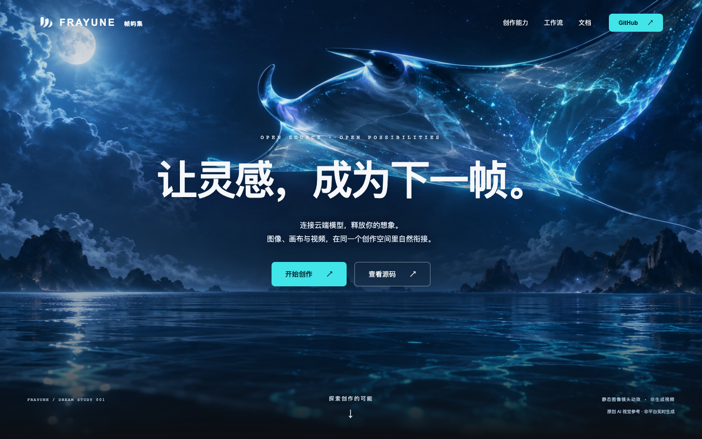

# 帧屿集 FRAYUNE

让灵感，成为下一帧。

连接外部云模型的 AI 视觉创作平台。统一组织图像生成、画布编辑与视频创作，让灵感成为作品。

[浏览项目主页](https://weilengdezaoshang.github.io/aiVideo/) · [功能概览](#功能概览) · [版本与代码](#快速开始) · [开发约定](AGENTS.md)

云模型 API &nbsp; / &nbsp; 统一创作工作台 &nbsp; / &nbsp; 图像与视频

## 功能概览

以下为正在开发的新版平台与官网展示方向，具体能力以实际发布版本和接入模型为准。

| 01 / 图像 | 02 / 画布 | 03 / 视频 |
| --- | --- | --- |
| **让文字，有了画面。** | **给灵感，展开的空间。** | **让下一帧，动起来。** |
| 通过云模型 API 生成与迭代图像。 | 编排素材、加工图像、保存创作上下文。 | 连接云模型的视频能力，整理片段并导出作品。 |

图像与视频生成模型运行在云端，平台负责创作流程、任务和素材管理。无需本地部署生成模型；云服务配置、支持模式与费用以提供方为准。

## 快速开始

**版本状态：官网已发布；新版云模型平台代码尚未同步到公开仓库。** 当前 `main` 中的应用仍为早期 SwarmUI MVP，实现和运行方式与新版产品预览不同。本次更新仅发布官网和 README，不将开发中的平台代码一并发布。

- 浏览新版设计与产品介绍：[帧屿集官网](https://weilengdezaoshang.github.io/aiVideo/)。GitHub Pages 为静态展示，不提供在线生成 API。
- 运行当前公开的早期版本：查看[早期版本安装与技术说明](docs/legacy-readme.md)。其中 Mock 与 ComfyUI 是该版本的实现，不是新版云模型平台的必要配置。
- 新版发布后，此处将更新平台部署与云模型 API 接入步骤。

## 参与构建

欢迎通过 [Issues](https://github.com/weilengdezaoshang/aiVideo/issues) 提交反馈。开发约定见 [AGENTS.md](AGENTS.md)，官网代码位于 [website](website/)，发布工作流为 [GitHub Pages](.github/workflows/pages.yml)。

## License

[MIT](LICENSE) © 2026 chenGuoFeng

封面为原创 AI 视觉参考，首屏镜头动效由静态图像实现，不是平台实时生成的视频。
