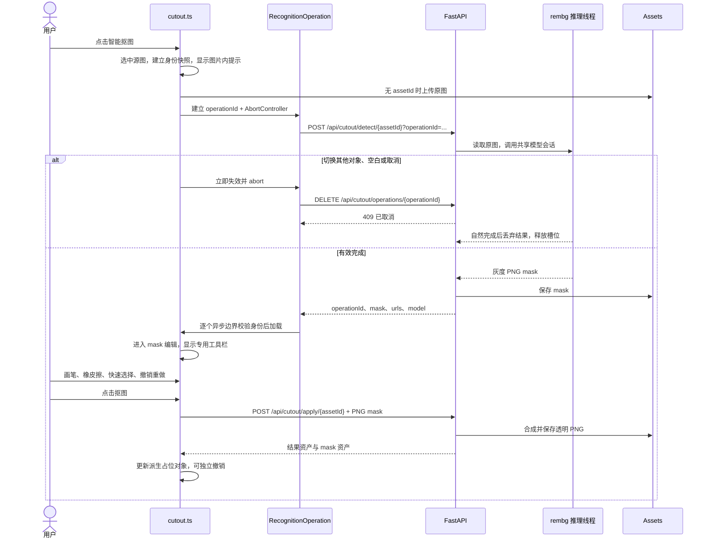

# 抠图流程与实现

前端业务模块使用 TypeScript，后端使用 FastAPI，直接在进程内调用 rembg。无需另起识别服务，不缓存 mask 或跨会话笔画草稿。

## 数据流

## 模块

| 模块 | 职责 |
| --- | --- |
| `engine/interaction.ts` | 输入归属、手势状态通知；识别中允许导航，其他点击先交给会话判断 |
| `flows/cutout.ts` | 蒙版会话、源图身份、工具栏、笔画历史、独立合成提交 |
| `flows/recognition-operation.ts` | 操作 ID、取消通知、响应归属与异步结果检查 |
| `flows/recognition-lock.ts` | 非模态图片内提示；仅取消按钮接受指针，不抢焦点 |
| `flows/asset-util.ts` | 原图上传与资源访问，识别前上传支持 AbortSignal |
| `backend/cutout.py` | rembg 模型懒加载、单推理线程、忙状态、取消标记、超时 |
| `backend/app.py` | 识别/取消/合成 API、断连监听、资产落盘和取消竞态清理 |
| `backend/frontend.py` | 原模块 URL 提供编译后的 TS，其他资源回退静态目录 |

`app.ts` 负责整页启动接线，只传递选中状态 getter；抠图业务逻辑在 `flows/cutout.ts`。现有拖动菜单互斥、圆点/边线 resize 行为沿用并由回归测试覆盖。

## 交互与异常

- 识别中点击当前图片不会移动、resize 或重复识别。点击其他对象或空白立即退出识别，同次按下转交普通选择；右键其他对象退出并打开其菜单。
- 空格/中键平移、滚轮缩放继续识别；提示跟随图片可见部分，离屏回退视口中心。识别过程不锁定整张画布。
- Esc/取消首次识别后保留源图选中。重新识别时 Esc/取消恢复已有 mask；失败也保留原选区、撤销栈。切换对象则退出编辑。
- 文档实例、源对象 ID、资产 ID/URL/扩展名或原图谱系发生变化，或选中集合改变，会话失效。删除、换图、导航离开、迟到响应都不能覆盖新会话。
- 每个请求具有独立操作 ID；在上传、请求、JSON 解析、图片加载之后重新检查。旧 catch/finally 不会关闭新提示或恢复旧模式。
- 取消先于 POST 到达时，后端的短期取消标记阻止启动推理。标记保留 5 分钟、上限 2048，不包含图片结果。
- 推理占用单线程且不排无界队列；忙时返回 429，超时 120 秒返回 504，识别失败返回 502，取消返回 409。API 健康检查与画布操作继续响应。
- 取消或超时不能安全杀死 ONNX 原生线程，线程结束前仍占用槽位。已取消结果不落盘；落盘期间发生取消时完成写入后删除该资产。
- 模型会话每进程加载一次。默认 `birefnet-portrait`，首次使用可能下载约 928 MB 权重；`CUTOUT_MODEL=isnet-general-use` 可切换通用模型。重启清空操作状态。
- 工具栏沿用单行深色布局：画笔、橡皮擦、智能识别、快速选择、undo/redo、积分与抠图按钮。当前合成不扣积分，不能显示虚构的扣费。
- 不新增识别结果缓存或跨次复用 mask；退出蒙版时丢弃选区与笔画历史；再次点击抠图必须请求新的识别结果，不读写旧 localStorage 草稿。Agent 显式传入的预备蒙版按既有流程加载。
- 点击抠图后，合成任务独立运行。切换选择不会取消合成；占位已删除则保留资产但不复活对象，失败保留可重试的信息。

## 启动与验证

安装 `requirements-dev.txt` 后运行 `npm run dev`。不要同时启动多个进程使用同一数据目录。

`npm run verify` 包含 TS 校验、编译、lint、前端交互/异步竞态测试与 Python API/真实 HTTP/SSE 测试。模型测试另行执行，普通单元测试注入推理函数，避免依赖模型下载与机器性能。
