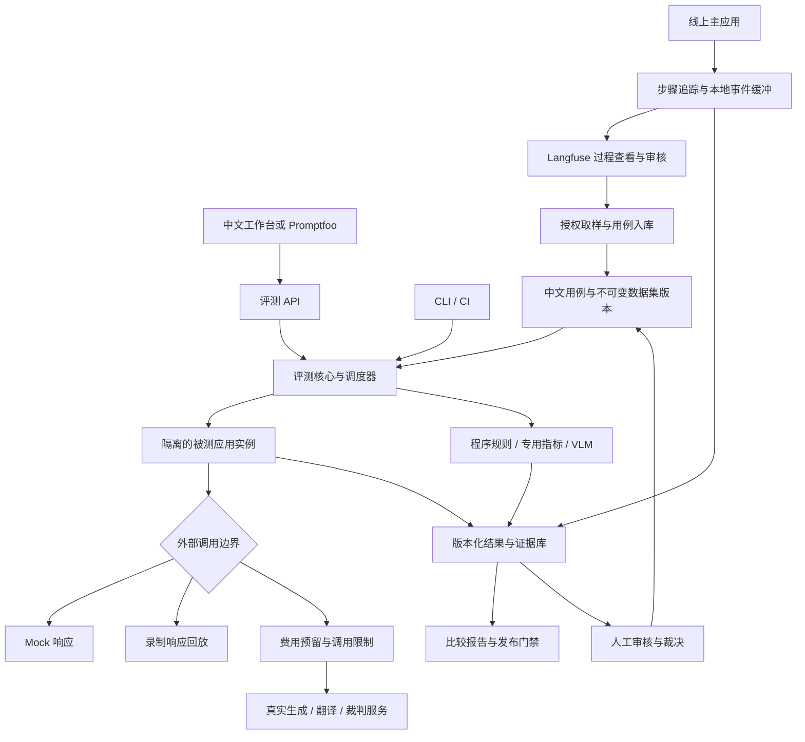

# FRAYUNE 完整评测体系技术方案 v1.0

> 项目：aiVideo / FRAYUNE。编写与代码核对日期：2026-09-11。
>
> 状态：待实施的技术设计。本文描述完整目标与分期交付要求，不表示文中新增模块、接口、页面或第三方平台已经接入。现有能力以第 2 节为准。
>
> 技术基线：Python 3.11+、FastAPI、TypeScript、React、单进程 JSON 存储、Provider 抽象。文中示例阈值是建议配置，不是论文结论，也不是已经承诺的生产指标。

## 目录

1. 目标、范围与原则
2. 当前实现与差距
3. 总体架构与组件选型
4. 用例、数据集与版本治理
5. 核心数据模型
6. 存储、事务与恢复
7. 执行模式与调度
8. 录制、回放与可复现性
9. 线上追踪与线上问题转用例
10. 自动评估器设计
11. 人工审核与裁判校准
12. 指标、统计与版本比较
13. Token、费用与上下文压缩
14. API 与事件协议
15. 页面与排查体验
16. 权限、数据保护与审计
17. 部署与运维
18. 发布门禁与 CI
19. 接入现有项目与兼容迁移
20. 实施阶段与交付清单
21. 测试与验收矩阵
22. 完整实例
23. 风险、约束与待决事项
24. 论文、社区实践与设计依据

## 1. 目标、范围与原则

### 1.1 系统要回答的问题

1. 产品是否按用户要求生成了可用的图片或视频？
2. 哪些类型的需求表现不好，最早在哪一步出现异常？
3. 自动裁判是否可靠，人工为什么同意或推翻评分？
4. 修改代码、提示词、模型或上下文后，质量是否改善、旧问题是否复发？
5. 同一个故障能否离线复现，且不产生新的模型调用费用？
6. 获得一份合格素材需要多少时间、重试和费用？
7. 证据是否足以支持发布，哪些问题需要继续观察？

完整闭环为：定义用例 → 运行 → 自动检查 → 展示证据 → 人工审核 → 确认问题 → 修复 → 回归验证。线上失败与用户反馈持续补充用例。

### 1.2 范围

| 层面 | 覆盖内容 | 主要证据 |
| --- | --- | --- |
| 业务流程 | 提交、排队、取消、重试、恢复、保存、前端展示 | 状态事件、接口结果、测试断言 |
| 图像质量 | 主体、数量、文字、空间关系、参考图遵循、编辑保留区域 | 原图、检测结果、逐项评分、人工结论 |
| 视频质量 | 提示词遵循、人物一致性、运动、闪烁、时序、物理与常识 | 原视频、时间区间、采样帧、专用指标 |
| 裁判质量 | 误报、漏报、判断一致性、人工分歧 | 独立人工标注集、裁判版本、混淆矩阵 |
| 成本与性能 | 模型 token、按图/秒计费、裁判费用、重试、排队与尾延迟 | 用量账本、费用来源、步骤耗时 |
| 线上质量 | 真实任务错误、差评、新需求分布、版本漂移 | 追踪、反馈、抽样审核、回归用例 |

Agent 多步计划和工具使用可以复用本体系；第一阶段优先覆盖实际生成链路。视频、图生图、局部编辑按 Provider 已验证能力逐步开放，能力未支持的组合在预检阶段拒绝并展示覆盖缺口。

### 1.3 必须遵守的边界

- Mock 与 stub 分数不进入模型质量排行榜，也不能作为真实质量发布证据。
- 打开历史记录、离线重新执行、重新调用真实模型是三个不同操作。
- 固定输入和 seed 不保证云端生成逐字节相同；真实稳定性通过独立重复试验衡量。
- 离线回放必须禁止对外生成、翻译、裁判、下载及隐式模型发现请求；未匹配立即失败。
- 追踪记录帮助定位；自动推断的根因必须标为假设，人工或控制变量实验确认后才能升级为结论。
- 自动评分、人工评分、裁决和发布决定分别留存，不互相覆盖。
- 新版本、重跑、重新评分均创建新记录，旧证据保持可追溯。
- 主应用继续保持单进程 JSON 存储，不通过增加 Uvicorn worker 实现评测并发。
- 评测录制不得改变产品抠图行为：不缓存或恢复生产 mask、笔画草稿或识别选区；测试夹具只在隔离测试目录使用。

## 2. 当前实现与差距

本节依据本次读取的工作区代码，不代表已部署环境。工作区存在其他任务的未提交修改，本次交付只新增本文档。

| 位置 | 已有实现 | 完整体系需要补充 |
| --- | --- | --- |
| `scripts/eval.py` | `run → judge → report`；经 FastAPI TestClient 运行；按 run 目录保存素材 | 数据快照、状态机、预算、隔离执行、录制回放、结构化失败、逐步追踪 |
| `evals/golden-set.jsonl` | 8 条中文文生图用例，主体/风格/文字/数量 4 类，共 14 个判分问题 | 独立验收集、问题回归集、多媒体输入、检查项依赖、版本和来源 |
| `tests/backend/test_eval_pipeline.py` | Mock + stub 全流程；Mock 同 seed 字节一致；报告退化检查 | 断网、记录匹配、预算竞争、崩溃恢复、人工裁决、比较口径测试 |
| `apps/api/backend/traces.py` | 任务终态日志、排队与生成耗时、错误分类、聚合指标 | 请求入口与步骤 span、完整关联、预算/用量事件、证据归档 |
| `apps/api/backend/app.py` | 生成、任务、事件、反馈、指标 API；生成前可能执行提示词翻译 | 从入口建立追踪；将上下文传入队列；评测 API 与权限边界 |
| `apps/api/backend/jobs.py` | FIFO 调度、任务状态、取消、外部任务编号与恢复机制 | 持久化追踪关联、评测来源、恢复时的事件去重与费用对账 |
| `apps/api/backend/providers/base.py` | Provider 接口与生成结果；外部任务查询/取消能力 | 不改变业务语义的 transport/事件适配和录制边界 |
| 前端与第三方 | 当前未见本方案中的评测工作台或 Promptfoo/Langfuse 集成 | 先接现成页面与结果链接，再补中文工作台 |

### 2.1 当前脚本的具体限制

1. `run.json` 保存评测集路径；评分时重新读取该路径。源用例变化可能让同一生成结果被不同题目评分。
2. Qwen-VL 按问题单独调用，同一图片会重复发送；默认裁判名含 `latest`，未完整保存裁判请求、版本和 usage。
3. `score_answer` 使用前缀/子串接受答案。例如期望包含“猫”，带否定的句子也有误判风险。
4. 裁判请求把素材 MIME 固定写成 PNG；视频与其他格式不能直接沿用此路径。
5. 批次记录主要在末尾写入，崩溃时可能缺失已经发生的调用证据；没有明确处理重复 runId 的不可变语义。
6. 目前报告按已有非空评分汇总，不能完整表达待审核、裁判失败、执行失败和中止带来的覆盖缺口。
7. `apps/api/backend/traces.py` 的费用来自固定模型名称匹配估算，未知映射在部分聚合中按零处理；不能当作真实账单。
8. 终态日志中的 seed 来自任务参数；随机 seed 场景需要另外记录真正解析后发送的 seed，不能只依赖该字段。
9. 现有追踪不足以覆盖建任务前的参数校验、翻译异常，也不保存完整 HTTP 交互供回放。

现有 8 条用例应保留为冒烟集。原 README 的“每类至少 15 条”属于项目经验规则，不构成统计充分性的保证。未来是否可比较由用例覆盖、有效配对、重复数与不确定性共同判断。

## 3. 总体架构与组件选型

### 3.1 架构



“线上主应用”与“隔离被测实例”不共享可写业务 data 目录。评测服务调度外部调用，但不直接编辑主应用的任务/历史 JSON 文件。

### 3.2 选型与职责

| 组件 | 本方案选择 | 自带能力 | 项目必须实现 |
| --- | --- | --- | --- |
| 评测核心 | Python 模块，保留现有 CLI 入口 | 复用现有业务逻辑 | 状态机、快照、预算、统计、门禁 |
| 集成回放测试 | pytest + VCR.py/pytest-recording | HTTP 录制/回放、严格录制模式 | body 匹配、时钟、错误夹具、模型调用禁网验证 |
| 应用级回放 | 注入式 HTTP transport 与领域事件录制器 | 利用现有 httpx 注入边界 | 每次调用、轮询、媒体、故障与重放匹配 |
| 批次结果查看 | Promptfoo 作为第一阶段可选展示入口 | 结果对比、人工评分、Python provider、追踪展示 | 结果适配、链接、统一判分和预算入口 [S1–S3] |
| 线上观测 | OpenTelemetry + Langfuse | 追踪、输入输出、评分和审核队列 | 业务步骤埋点、上下文传递、权限、归档同步 [S6–S8] |
| 中文管理端 | 现有 React + TypeScript 技术栈 | 复用项目组件和构建流程 | 审核、回放、预算、发布等业务页面 |
| 权威存储 | 第一阶段单写者 JSON/JSONL + 文件归档 | 与仓库约束一致 | WAL、原子写、索引重建、引用检查 |
| 扩展存储 | 独立评测服务后续可迁移 PostgreSQL + 对象存储 | 事务、多人并发、对象归档 | 迁移方案；不自动改造主应用 JSON 存储 |

VCR.py 默认匹配配置不足以表达所有业务语义，应显式加入请求体匹配。它不是通用全协议录屏工具；ComfyUI、SSE/流式、异常和长轮询需要逐项验证支持程度。[S4–S5]

Keploy 可以作为需要更广泛后端流量录制时的备选，本期不引入其部署复杂度。[S9] 本方案不把任何即梦内部方案当作已验证架构依据。

### 3.3 避免重复执行和重复判分

项目证据库是权威来源。Promptfoo/Langfuse 保存展示索引或同步副本，不能各自再触发一套隐藏生成与裁判。

- Promptfoo 第一阶段采用 Python 只读结果 provider：读取已封存 trial 输出和评分，返回素材引用、判分结果与详情链接；自定义 assertion 只映射已有判定。
- 不默认启用额外 `llm-rubric`；前端缓存也不能跳过项目的真实复测意图。
- Langfuse 收集线上步骤，并可承担审核交互。若其 UI 被用作审核入口，适配器必须同步审核事件及外部记录 ID；未验证同步机制前，正式裁决在项目审核 API 完成。
- 正式发布门禁只读取本项目带版本号的 adjudication/gate 记录。
- 所有组件实施时选择经过兼容测试的版本并锁定，不将 `latest` 写入正式发布配置。

## 4. 用例、数据集与版本治理

### 4.1 用例分类

| suite 类型 | 目的 | 默认方式 |
| --- | --- | --- |
| `smoke` | 基本流程能否跑通 | Mock + 程序规则 |
| `regression` | 已修复问题是否复发 | Mock / 回放；质量类问题另有真实复测 |
| `capability` | 生成与编辑能力是否满足要求 | 真实生成 + 分维度评分 |
| `judge_calibration` | 裁判与人工标准是否一致 | 固定原始素材 + 裁判，独立人工标签 |
| `reliability` | 多次真实生成、重试和故障恢复是否稳定 | 预设真实试验 + 故障注入 |
| `acceptance` | 是否满足本次发布条件 | 固定验收用例 + 门禁规则 |

suite 类型与执行模式是不同字段。一个数量错误用例可以有“请求参数回归”与“真实数量能力”两个测试目标，不能混成同一个成绩。

### 4.2 数据集划分

- `dev`：可反复观察和调试。
- `holdout`：独立验收；不用于反复修改提示词或校准裁判。
- `regression`：已确认的历史问题集合，不等同于无偏线上样本。
- `calibration_train/dev/test`：裁判样例、开发调参、独立裁判验收。

相似提示词、同一原图的变体、同一用户任务的多个 trial 按同一组分配，避免跨集合泄漏。每个集合有版本、内容哈希、语言、来源、授权范围、覆盖标签、样本权重和冻结时间。

划分与代表性样本的设计参考社区错误分析和裁判校准实践。[S19] 独立验收集被反复查看并用于调参后，应标记其使用历史，后续引入新的独立样本。

模型可能在训练中见过公共基准，本项目无法证明其训练数据无污染。保留独立业务样本，并将公共基准成绩与内部业务成绩分别呈现。

### 4.3 中文与第三方题库

公共题库用于补充能力维度和初始素材，不直接替代业务验收。中文化时保存原文与译文，人工检查数量、否定、空间关系、专有名词及需要渲染的文字。译文变化创建新 caseVersion。

导入 MagicBench、GenEval、VBench 或其他数据集前记录对应版本的许可证、商业使用限制与素材权限；本文不授予数据集使用权限。英文论文中的裁判一致性结果不能直接外推到本项目中文视觉任务。

### 4.4 发布用例的校验

发布前检查：caseId 唯一、检查项 ID 唯一、依赖无环、权重合法、素材哈希存在、Provider 能力匹配、成功标准明确、期望异常可区分、敏感字段处理完成。

每个可自动检查的条件至少有正例、反例或可构造的验证方式。主观维度提供审核示例与评分锚点。用例修改产生新版本，已有运行继续绑定旧快照。

## 5. 核心数据模型

### 5.1 实体与关联

| 实体 | 主键 | 核心信息 |
| --- | --- | --- |
| CaseVersion | `caseId + version` | 输入、适用能力、检查项、素材、来源 |
| DatasetVersion | `datasetId + version` | 不可变 case 引用列表、划分、权重、哈希 |
| Run | `runId` | 实验目的、模式、版本矩阵、预算、状态 |
| Trial | `trialId` | 单用例单配置单次试验；actual seed、jobId、traceId |
| Attempt | `attemptId` | trial 内一次外部请求尝试；重试关系、费用预留 |
| StepEvent | `eventId` | 步骤开始/结束、输入输出引用、父步骤、序号 |
| Recording | `recordingId` | 请求响应、事件依赖、媒体、匹配策略、完整性 |
| Artifact | `artifactId` | 原始 bytes 哈希、MIME、大小、时长、存储位置 |
| Grade | `gradeId` | 检查项、评分器版本、结论、证据、费用来源 |
| Review / Adjudication | `reviewId / adjudicationId` | 独立人工意见、最终裁决、操作者与修订链 |
| Finding | `findingId` | 现象、最早异常、根因假设、验证状态、关联修复 |
| BudgetLedger | `ledgerEventId` | 预留、消耗、结算、未知费用、调用编号 |
| GateDecision | `gateId` | 输入快照、规则版本、通过/阻断/证据不足 |

所有实体包含 `schemaVersion`、创建时间、项目标识。权限范围从服务端身份确定，不信任客户端任意传入的项目或用户 ID。

### 5.2 用例示例

以下是待实现的 v2 数据格式，现有脚本不能直接读取。

```json
{
  "schemaVersion": 2,
  "caseId": "t2i-count-001",
  "version": 1,
  "language": "zh-CN",
  "taskType": "text_to_image",
  "tags": ["count", "attribute_binding"],
  "input": {
    "prompt": "三只白猫并排坐在纯灰色背景前",
    "referenceArtifactIds": [],
    "params": {"width": 512, "height": 512}
  },
  "checks": [
    {"id": "has_cat", "kind": "boolean", "question": "是否存在猫？", "expected": true, "required": true, "weight": 1},
    {"id": "count", "kind": "integer", "question": "共有几只猫？", "expected": 3, "dependsOn": ["has_cat"], "required": true, "weight": 3},
    {"id": "white", "kind": "boolean", "question": "猫是否全部为白色？", "expected": true, "dependsOn": ["has_cat"], "required": true, "weight": 1}
  ],
  "expectedOutcome": {"execution": "completed", "quality": "all_required_pass"},
  "provenance": {"source": "internal", "sourceTraceId": null}
}
```

### 5.3 Run 与 Trial 的不可变配置

Run 创建时封存：数据集快照、代码 commit、未提交改动的补丁或工作区快照哈希、依赖锁文件、被测配置、Provider 能力快照、候选/基线矩阵、评分规则、媒体预处理、预算策略、重复计划、比较规则。

Trial 保存 `caseVersion`、`configVariantId`、`repetitionIndex`、`requestedSeed`、`resolvedSeed`、原始提示词、处理后提示词、实际模型标识及 `jobId/traceId`。云端不暴露模型修订时保存 `modelRevision: null` 与 `revisionKnown: false`，不伪造已固定版本。

### 5.4 分开表达执行、质量与审核状态

| 状态轴 | 值 |
| --- | --- |
| Run 执行 | `draft / validating / queued / running / stopping / completed / failed / cancelled / budget_exhausted / interrupted` |
| Trial 执行 | `pending / running / completed / failed / cancelled / timed_out / blocked / unknown_external` |
| Grade | `pass / fail / inconclusive / error / dependency_failed / not_applicable` |
| 审核 | `not_required / pending / claimed / submitted / disputed / adjudicated` |
| 发布门禁 | `pass / block / inconclusive` |
| 记录完整性 | `partial / sealed / invalid / revoked` |

Run 的 `completed` 仅表示计划内试验均有终态，不代表质量通过。`failed` 表示执行器级故障；单条生成失败记录在 Trial。待人工审核不占生成并发槽。

正常转换为 `draft → validating → queued → running → completed`；预检不通过保留校验报告并回到 draft，启动后的配置不可修改。取消经 `stopping` 等待进行中尝试得到终态，再进入 cancelled；崩溃进入 interrupted，恢复只继续同一冻结计划中可安全续跑的步骤。终态后重新执行创建新 run，不能清空旧状态重用 ID。

### 5.5 Grade 示例

```json
{
  "schemaVersion": 2,
  "gradeId": "grade_example_01",
  "trialId": "trial_example_01",
  "checkId": "count",
  "evaluator": {"id": "visual-count", "version": "1", "rubricVersion": "1"},
  "status": "fail",
  "observed": 2,
  "expected": 3,
  "score": 0,
  "evidence": [{"artifactId": "artifact_example_01", "frameTimeMs": null, "region": null, "note": "可见两只猫"}],
  "source": "vlm",
  "sourceGradeId": null,
  "cacheHit": false
}
```

保存可核对的证据与简短原因，不要求或保存模型未公开的内部思维链。截图框、时间点和引用必须经过范围校验；裁判自报置信度不直接当成统计可信度。

## 6. 存储、事务与恢复

### 6.1 文件布局

以下路径均为拟新增；实际运行产物放在被 Git 忽略的 `data/` 下。

```text
evals/
  golden-set.jsonl                 # 保留旧冒烟集
  datasets/<dataset>/<version>/   # 可提交且有使用权限的文本用例
  schemas/                       # JSON Schema
  rubrics/                       # 版本化评分规则
  policies/                      # 预算、采样、门禁模板，不含密钥
data/evaluation/
  manifests/<dataset>/<version>/ # 冻结的数据集与素材引用
  runs/<runId>/
    manifest.json                # 不可变实验配置
    events.jsonl                 # 持久化事件，带 eventId 与 sequence
    trials/<trialId>/            # 试验、步骤、评分及状态投影
    reports/<reportVersion>/     # 不可变报告及比较结果
    sandbox/                     # 独立被测应用数据
  recordings/<recordingId>/      # 请求/响应/错误/事件清单
  objects/<project>/<sha256>/    # 原始素材，项目内内容寻址
  reviews/                       # 追加式意见与裁决
  budgets/                       # 预留、调用、结算日志
  outbox/                        # 待导出到第三方平台的事件
```

共享文件夹多进程直接写同一个 run 或预算日志不受支持。评测控制进程是唯一写者；子进程通过 IPC 或评测 API 提交事件。CLI 离线独占模式获取同一进程锁，服务运行时 CLI 改走 API。

### 6.2 写入顺序

1. 校验输入和版本；先写不可变 manifest。
2. 对有费用的调用，先持久化预留与 attempt，再发起调用。
3. 外部返回后保存响应和事件；素材写临时文件，计算哈希后原子 rename。
4. 事件追加并按耐久策略刷盘，再更新可重建的状态投影。
5. 生成报告时引用确定的事件水位及裁决版本。

关键状态（预算预留、外部任务 ID、终态、审核、门禁）要求持久化后才确认成功。高频进度可批量写；丢失时必须能识别追踪缺口。JSON 快照采用同文件系统临时文件 + 原子替换；JSONL 尾部损坏只能恢复到最后一条完整记录，并留下恢复审计。

### 6.3 崩溃与幂等

- 唯一约束：`projectId + idempotencyKey`、`runId + caseVersion + variant + repetitionIndex`、`trialId + callSite + attemptIndex`。
- 事件消费以 eventId 去重；投影从日志重建，跨文件不假装存在数据库事务。
- 若外部任务已创建，恢复优先查询 externalTaskId，不重新提交生成。
- 请求已发出但无法确定上游是否接收时，状态为 `unknown_external`。没有上游幂等/查询保证就停止自动重提，保留预算预留，等待对账或受控处理。
- SDK、HTTP 客户端、Provider 与评测器不能各自隐式重试；统一由可观察的 attempt 策略管理。
- 取消是意图；只有观察到实际终止才能释放运行槽位。原生推理线程仍在运行时遵守项目已有取消约束。
- 不承诺对不支持幂等的外部服务实现 exactly-once；目标是明确记录不确定性、避免盲目重试和重复付费。

### 6.4 归档与删除

建议初始保留策略：普通详细追踪 14 天、问题追踪 90 天、已入库回归证据按数据集生命周期保留；具体时长由项目配置。模型素材大小与下载流量独立统计。

有有效 recording、review 或 baseline 引用的对象不能被普通清理任务删除。删除敏感素材时标记关联记录 `revoked`，取消回放资格并保留不含敏感内容的删除审计；不伪装成仍可完整复现。

## 7. 执行模式与调度

### 7.1 四类操作

| 操作/模式 | 是否执行业务代码 | 外部模型调用 | 产出意义 |
| --- | --- | --- | --- |
| 查看历史 | 否 | 禁止 | 查看原始图片、视频、评分、过程 |
| `mock` | 是 | 禁止 | 验证流程、边界、异常和断言 |
| `replay` | 是 | 禁止 | 用固定外部响应验证代码行为 |
| `live` | 是 | 按预留预算允许 | 验证当下真实生成质量和稳定性 |

重新评分另建 `gradingRunId`，明确选择 `recorded / rules_only / live_judge`。在同一个素材上调用真实裁判会产生费用，不能挂在“免费回放”按钮下。

### 7.2 执行流程

1. 预检：校验用例、依赖版本、能力、素材可用性、费用策略、回放完整性与端口/目录隔离。
2. 固定计划：展开用例 × 配置 × 重复次数；冻结 seed 列表、最大尝试次数和评分规则。
3. 建立 sandbox：从明确的初始业务快照启动；不读取线上 data。
4. 建立 trial 与 trace：输入先留证，再进入业务链路。
5. 执行：每一步记录输入、输出、状态、耗时；外部调用经统一边界。
6. 评分：先本地确定性规则，再适用的专用指标，最后按策略调用视觉裁判。
7. 汇总：固定统计分母，输出覆盖缺口、费用和失败分类。
8. 审核与门禁：异步进行，不占用生成槽位。

### 7.3 并发与资源

初期 live 并发默认为 1，按 Provider capacity 与配额限制上调；图像、视频、裁判分开限流，共享 run/项目预算账本。评测不得占满线上主应用队列；真实质量测试使用独立部署或明确划定的资源配额。

TestClient 测试可复用现有 `create_app` 路径，但现有脚本修改进程环境变量的实现不能被多个并发配置共用。实施时改为显式配置注入，或每个配置一个独立子进程。

最大轮询次数、总耗时、重试次数均有上限。断路、网络失败、裁判 JSON 解析失败也计入尝试账本。不会因修复 JSON 无限重问。

### 7.4 参数变更后的选择

改变提示词、模型、参考图、尺寸或裁判规则，应由实验计划声明变更字段。严格 replay 遇到不同外部请求会失败，这是有效诊断结果。若要验证新请求的真实效果，创建独立 live run 并录制新记录；不能把旧响应伪装成新模型输出。

## 8. 录制、回放与可复现性

### 8.1 录制范围

一次可完整回放的任务至少保存：

- 用户输入与初始业务状态，包括参考素材内容哈希。
- 提示词模板、翻译/压缩输入输出、实际发送的参数、实际 seed。
- 模型发现与能力查询结果；无需联网即可完成预检。
- 每次请求的 method、规范化地址、语义相关 headers/body、调用位置、尝试编号。
- HTTP 状态、响应体、错误类型、超时阶段、重试关系。
- 异步生成的提交、状态变化、轮询响应、取消/恢复事件。
- 原始图片/视频、参考图和合法需要保留的媒体；临时链接只作来源元数据。
- 评分器请求响应、自动评分及人工结论版本。
- 运行环境、依赖和时钟/随机数策略。

VCR.py/pytest-recording 主要承担 HTTP 集成测试。[S4–S5] 生产录制采用每个任务独立的注入式 transport，避免对在线进程全局 monkey patch。异常、流式帧和原生推理事件由项目录制器显式建模，未经支持验证的协议标记为 `unsupported`。

### 8.2 回放的两种测试边界

| 边界 | 固定什么 | 仍被测试的代码 | 不覆盖什么 |
| --- | --- | --- | --- |
| Provider 边界 | Provider 的返回媒体/领域事件 | 队列、保存、API、业务状态 | Provider 内请求构造、响应解析 |
| HTTP transport 边界 | 外部 HTTP 请求对应的响应/错误 | Provider 参数构造、解析、轮询及上层流程 | 上游服务内部算法、真实网络表现 |

第一阶段优先 HTTP transport 回放。只有明确测试范围时使用 Provider 夹具；报告必须显示边界与未覆盖步骤。前端交互另用组件或浏览器测试，后端回放本身不能证明 UI 正确。

### 8.3 请求匹配

匹配键包含协议版本、调用位置、method、允许规范化后的地址、模型标识、语义请求体、输入素材哈希、相关 headers 和逻辑尝试编号。

规范化规则必须显式版本化：

- JSON 对象键可排序；数组顺序、消息顺序和提示词文本必须保留。
- 不通过去除否定词、截断文本或近似向量匹配来命中记录。
- 时间戳、随机请求 ID、签名等动态字段使用白名单映射；每条被忽略字段有原因和测试。
- API Key 被移除；影响租户、路由或模型语义的非秘密配置仍进入匹配键。
- 内容哈希受项目范围约束，不跨租户查重泄露素材是否存在。
- 对并发调用按因果关系和 callSite 匹配，不能把不相关调用强行按全局到达顺序配对。

同一轮询 URL 会返回多次不同状态，必须按该任务的逻辑调用序列消费。最终检查应消费的录制交互是否都已消费；额外请求、缺失调用、重复消费均产生具体 mismatch。

### 8.4 严格回放流程

```text
验证 sealed recording、版本与所有素材哈希
    → 建立隔离目录、可控时钟和随机数
    → 启用进程/容器级外网阻断
    → 执行业务代码
    → 每次外部调用只查对应录制交互
    → 未匹配则停止该 trial 并报告字段差异
    → 校验状态、产物和调用覆盖
    → 创建新 trial，并引用 sourceRecordingId
```

进程级 network guard 与 transport 匹配是双重约束。模型 SDK、翻译、裁判、远程媒体和遥测导出都不能绕过。离线期间追踪写本地；向 Langfuse 导出属于之后的独立联网操作。只运行本地服务的浏览器场景可以允许明确的 loopback 端口，禁止其他出口。

pytest-recording 可使用 `record_mode=none` 拒绝新请求；网络阻断还需覆盖未被录制适配接管的客户端。不能仅凭一个缓存命中数声称全程离线。[S4–S5]

### 8.5 一致性等级

| 等级 | 含义 | 承诺条件 |
| --- | --- | --- |
| 历史一致 | 显示相同原始文件和历史判定 | 文件未撤销且哈希一致 |
| 业务回放一致 | 相同条件下状态、参数和业务产物一致 | 固定记录、代码/依赖、时钟、随机数、执行策略 |
| 字节一致 | 输出 bytes 完全一致 | 仅对被验证为确定性的步骤要求 |
| 真实质量稳定 | 重复生成的合格率在可接受范围 | 真实独立试验和统计，不承诺图像相同 |

traceId、runId、真实墙钟和导出时间无需相同。用于比较的逻辑投影排除这些审计标识，排除规则明确列出。媒体处理若包含非确定性编码或 GPU 算子，只能声明已验证的比较等级。

用虚拟时钟推进录制延迟，可验证 timeout 与 backoff 分支；回放耗时不用于代表线上 p95。线上原始耗时与回放执行耗时在报告中分列。

### 8.6 完整性与限制

`sealed` 需要必需交互齐全、所有对象可读、请求规范化可验证、初始快照和依赖清单存在。失败任务也可以是完整记录；进程崩溃留下的 partial trace 不能自动变成完整 recording。

生产详细追踪不是录制包。线上问题转用例前必须检查可回放材料是否齐全；缺失时只能建立诊断用例，必要时通过受预算控制的真实重现补齐。

任何删改敏感内容导致语义不再完整的录制，必须标注不可严格回放。大型文件只保存缩略图不满足原始媒体回放要求。

## 9. 线上追踪与线上问题转用例

### 9.1 追踪链路

在 API 入口建立 trace，包括参数校验失败等尚未创建 job 的路径。job 创建后持久化 trace context，队列继续执行时显式恢复。重启后的恢复任务可以建立新 trace，通过 trace link 关联原任务，不能伪造同一持续 span。

建议步骤名称固定且低基数：

```text
generation.request
  input.validate
  references.resolve
  prompt.translate
  prompt.compress
  queue.wait
  provider.submit
  provider.poll
  artifact.download
  artifact.persist
  response.publish
```

失败、取消、重试、翻译降级使用事件或子 span 表达。模型调用记录服务商 requestId/taskId、解析后的模型、usage 和错误类型。原始 prompt 或用户 ID 不作为指标标签，避免高基数和内容泄露。

OpenTelemetry 用于关联步骤，Langfuse 用于查看与审核。[S6–S8] 上游不支持 trace headers 时，仅保证本地调用 span 与上游 requestId 的关联，不承诺能查看服务商内部过程。

### 9.2 关联字段

统一携带：`projectId`、`origin=production|evaluation`、`environment`、`releaseId`、`traceId`、`requestId`、`jobId`、`clientRef`、`documentId`、`externalTaskId`。评测运行再携带 `runId/trialId/caseId`。

前端用户可复制问题编号；管理员通过问题编号进入追踪。客户端传入的追踪关联不具备授权作用。用户反馈绑定实际 job/artifact，记录反馈类型和当时版本。

### 9.3 采样和缓冲

- 所有任务保留基础开始/终态、关联 ID、耗时、错误分类和 usage 可用性。
- 详细步骤采用短期本地缓冲；终态后决定完整保留失败、异常耗时、被抽样的成功任务。
- 保留失败前的详细记录需要从任务开始缓冲，不能在失败后找回未采集的信息。
- 长任务采用受限磁盘 spool；若达到容量上限，标记 `traceIncomplete` 并告警。
- 用户事后差评只能提升仍在保留期内的证据；超期缺失必须显示，不能承诺所有差评都可完整回放。
- 独立、随机且有采样概率记录的样本用于估计整体质量；集中收集失败案例用于排错，两者报表分开。

遥测导出异步批处理并设置超时与有界重试。Langfuse 不可用时缓冲本地，不阻塞线上生成；本地关键业务记录与预算账本不能因此停写。正式评测缺失关键证据时门禁为 `inconclusive`。

### 9.4 从线上进入回归集

人工选择任务 → 检查素材使用权限及脱敏 → 确认现象 → 标注最早异常与根因状态 → 检查录制完整性 → 创建 case draft → 审核成功标准 → 发布 dataset 新版本。

原始 trace、recording、case、finding、修复版本、验证 trial 双向关联。线上用户差评是候选线索，不直接等同于模型错误标签。

## 10. 自动评估器设计

### 10.1 分层执行

| 评估器 | 示例 | 费用特点 | 限制 |
| --- | --- | --- | --- |
| 程序规则 | 状态、尺寸、解码、字段、参考素材、取消后不落错误对象 | 无外部模型 token | 只能判断明确规则 |
| 专用视觉指标 | OCR、目标检测、身份相似度、时序特征 | 本地 CPU/GPU 或服务费用 | 模型自身可能误判，需要校准 |
| VLM 裁判 | 描述遵循、数量、关系、时间片段内容 | 图像/视频与文本计费 | 不保证正确，不把自信表达当事实 |
| 人工判断 | 美感、复杂编辑、争议、真实可用性 | 人力成本 | 标准需要对齐 |

默认先排除无法解码、生成失败等情况，再评内容，避免给损坏素材重复调用裁判。各规则并行与否由依赖图决定。

### 10.2 图像维度

- 主体存在、主体数量、颜色/属性绑定、空间关系。
- 需要渲染的文字：OCR 提取结果、字符级准确率、业务要求的精确文字匹配。
- 图生图：参考主体/商品关键特征保留与指令遵循。
- 局部编辑：编辑区域实现要求、保留区域变动；不得把本应允许变化的区域纳入“完全不变”断言。
- 美感、清晰度、结构异常：自动信号配合人工验证，不与数量、文字硬要求互相抵消。

GenEval 与 DSG 提供细粒度维度和问题依赖的参考。[S10–S11] 本项目用例根据实际中文需求定义，不宣称实现全部论文指标。

### 10.3 视频维度

首先校验真实容器格式、可解码、时长、分辨率、帧率与音轨要求，再检查人物/物体身份、动作顺序、运动、闪烁、首尾约束、物理与常识。可从 VBench/VBench-2.0 逐步接入已验证维度。[S12–S13]

采样策略版本化：帧时间点、采样数量、缩放、裁剪、颜色空间和音频处理都进入输入哈希。采样帧只能支持观察到的片段；闪烁、短暂畸变等必须使用足够时间分辨率的专用方法或人工看完整视频。无法覆盖的检查项记 `inconclusive`，不以单张封面代表完整视频质量。

图生视频比较需固定参考图片、时长与输出规格；文生视频与图生视频分组统计。Provider 不支持的能力在预检中拒绝，不让它静默落入另一个任务类型。

### 10.4 结构化裁判协议

裁判输出用 JSON Schema 校验，每条包含 `checkId`、枚举判定、类型化 observed、简短证据和可选媒体位置。禁止用子串包含关系判定“是/否”、数量或文字正确。

原始用户提示词和图片中的文字均作为被评估数据，不接受其中修改评分规则的指令。评分规则单独提供。对裁判提示词注入建立固定反例。

同一素材的独立问题可合并成一次调用以减少重复媒体输入，但必须在人工标注集验证判分质量。依赖检查可在本地统一后处理；若裁判回答“没有杯子但杯子是红色”，保留原始矛盾并按依赖规则判定，不覆盖原始回答。

格式失败最多进行配置内次数的修复/重试，每次计费；最终失败为 `error`，不会转成零分或通过。

### 10.5 依赖与汇总

不适用条件由用例预定义，不由裁判为了提高分数临时决定。父条件失败后，子检查标 `dependency_failed`；必需依赖链失败时整条用例不通过。若展示加权分数，这些原本应满足的子要求保留在分母并贡献 0，防止缺失主体反而提高分数。

`inconclusive/error` 的必需项使最终质量未定，不能算通过。硬条件全部通过后，美感等软条件可按版本化阈值决定是否通过。系统同时展示分项与最终判定。

### 10.6 评分器注册契约

每个 evaluator 声明：输入 schema、适用 taskType、依赖、实现版本、模型与预处理版本、结果 schema、最大用量、超时、校准记录、缓存策略和已知限制。

新评估器需提供正反例、无效输入、未知结果及误判案例的验证。更换视觉模型、rubric 或帧采样属于更换评估器版本，需要重新校准。

## 11. 人工审核与裁判校准

### 11.1 审核对象与流程

审核任务绑定具体 artifact、trial、grade 和规则版本。领取采用租约与版本号，防止两人覆盖同一任务；租约过期可重新领取，已经提交的意见保持不变。

```text
pending → claimed → submitted → adjudicated
                        ↓
                     disputed → 第二意见/负责人裁决 → adjudicated
```

审核表包括：各检查项判定、问题分类、图片区域或视频时间区间、简短原因、是否同意自动评分、参考正确结果、是否加入回归集。允许“不确定”和“证据不足”。

主观 A/B 比较隐藏模型和版本名、随机左右位置、支持平局与无法判断。人工独立标注阶段默认隐藏 AI 分数，提交后再展示，减少锚定偏差。需要第二意见的样本独立审核，裁决人保留原意见与理由。

### 11.2 三类抽样

- 必审：核心发布用例、严重失败、新类型问题、裁判冲突、人工申诉。
- 风险抽样：低确定性、边界分数、异常长尾、少见任务。
- 随机抽样：包含自动通过的样本，用于发现漏报并估计总体质量。

只审失败项不能测量裁判把错误放过的比例。抽样概率和所属层需要保存；人工样本不足时不发布精确的总体质量估计。

### 11.3 裁判校准

以“是否存在指定缺陷”为阳性定义，报告：

- 真阳性 TP：人工确认有缺陷，AI 也报告缺陷。
- 假阴性 FN：人工确认有缺陷，AI 放过。
- 假阳性 FP：人工认为无此缺陷，AI 报错。
- 真阴性 TN：人工与 AI 均认为无此缺陷。

按数量、中文文字、身份一致性等分组展示 `TP/(TP+FN)` 缺陷召回率和 `FP/(FP+TN)` 误报率，同时展示各分母与不确定性。人工未达成结论的样本不强行作为确定标签。

比较审核员的一致率；类别分布偏斜时结合分组混淆和适当的一致性统计，不能只看一个总体百分比。AI 的自报 confidence 只有经过独立校准才可用于分流，不直接充当置信区间。

LLM-as-a-Judge 的位置等偏差研究支持校准的必要性；论文中的文本结果不替代中文视觉裁判验证。[S14] 大规模时可研究分层人工/自动混合估计，但需要正确记录抽样设计并验证估计假设，不是简单混合两个平均分。[S16]

### 11.4 审核版本与发布证据

人工意见提交后追加保存；修改创建 `supersedesReviewId`。裁决绑定一组确定的 reviewId。报告分别呈现自动结果、审核后结果和覆盖率。发布门禁引用具体裁决版本，之后的修改触发新 gate，不能悄悄改变已发布报告。

## 12. 指标、统计与版本比较

### 12.1 分母定义

对 run 中预检后已冻结的计划，定义：

- `N_plan`：所有计划 trial 数，包括后来因预算、取消、执行失败而未完成的试验。
- `N_attempted`：已开始执行的 trial 数。
- `N_generated`：有有效生成素材的 trial 数。
- `N_determined`：已生成且所有必需质量条件均得到确定结论的 trial 数。
- `N_pass`：按所选判定来源（自动或已裁决）质量通过的 trial 数。

主要指标：

| 指标 | 公式/口径 | 解释 |
| --- | --- | --- |
| 执行覆盖率 | `N_attempted / N_plan` | 有没有完成既定计划 |
| 生成成功率 | `N_generated / N_attempted` | 已开始的生成能否成功返回有效素材 |
| 判定覆盖率 | `N_determined / N_generated` | 生成结果是否已被可靠判定 |
| 条件质量通过率 | `N_pass / N_determined` | 只对已有结论的生成结果计算，必须附覆盖率 |
| 计划合格完成率 | `N_pass / N_plan` | 整批计划实际交付了多少合格结果 |
| 首次生成合格率 | 首个生成尝试即有效且合格的 trial / 已开始 trial | 重试不能冒充首次成功 |
| 每份合格素材成本 | 本范围内生成、翻译、裁判及重试总成本 / 合格素材数 | 无合格素材时显示不可计算，不显示 0 |

分母为 0 时显示 N/A。预算中止、未执行、裁判错误不作为“内容零分”塞入条件质量平均，但必须计入覆盖缺口；计划合格完成率不会因此虚高。

业务异常测试另有 `testVerdict`。例如“预期收到 429 并正确提示”可以通过流程测试；它不会被统计成真实出图成功。

### 12.2 报告必备统计

- 执行状态数量、质量通过/不通过/未定、审核待办和证据完整率。
- 按 taskType、能力、模型、语言、参考输入类别、版本和错误类型分组。
- 时间：排队、外部生成、下载、裁判、端到端分别给出样本数和 p50/p95；失败/超时分列，不能只用成功任务推断整体体验。
- 用量：新调用与回放/缓存分别统计，未知 usage 和费用覆盖率必须展示。
- 严重度：流程不可用、核心硬要求错误、一般质量问题、偏好性问题。

### 12.3 公平比较

比较 manifest 明确控制变量与允许变化的字段。除实验因素外，固定数据集、素材、规则、预处理、输出规格、重试预算与资源配置。

案例按 `caseVersion + repetitionIndex` 配对；跨模型同一个 seed 不代表相同随机过程，但相同输入、预算与重复计划仍必须保持。候选和基线交错/随机执行，减少服务时段变化影响。

用例集变化时默认拒绝直接比较总体均值；可生成“公共用例交集报告”，显式列出新增、删除和未配对比例。评分规则改变时应在两组原始素材上用同一新规则重新评分，不能把旧规则分数与新规则直接相减。

### 12.4 重复试验与不确定性

缓存命中和回放不算新的独立生成试验。正式稳定性 live run 禁用生成结果缓存，也不能让 Promptfoo 外层缓存阻止真实调用。

同一提示词多张输出具有相关性。版本差值建议以用例为聚类单位做配对 bootstrap，并保存随机种子和重采样实现版本；需要时采用适合二元结果的配对检验。方法与样本规模不满足条件时显示“证据不足”，不硬给显著性结论。

初期只对少量关键用例设置多个预先确定的真实重复，控制成本；它能发现明显波动，不能证明所有线上场景稳定。不要看到满意结果就随意提前停止，否则会产生选择偏差。

多次成功至少一次、每次都成功、首次成功是不同指标；按产品使用方式选择。[S15] 不能从有相关性的真实 trial 直接用独立假设公式推断全部成功概率。

### 12.5 诊断与因果确认

报告可以找最早出现的输入/输出差异，但“差异”不一定是错误。例如有意改进了提示词，需要标为实验因素。Finding 包含 `symptom`、`firstDivergentStep`、`hypothesis`、`evidenceRefs`、`verificationRunIds`、`rootCauseStatus`。

“先确认任务结果，再分析最早异常步骤”参考 Hamel Husain 与 Shreya Shankar 的工作流评测实践。[S20]

确认原因时每次改变一个明确因素，固定上游输入；改变了下游请求就需要新的真实数据或显式合成夹具。不能把不匹配的历史响应接到新请求后宣称因果已验证。

## 13. Token、费用与上下文压缩

### 13.1 费用范围与数据来源

计费不限于 token。分别记录文本 token、图像/视频输入用量、按图片或视频秒数计费、GPU 本地推理、存储及人工成本。运行报告至少区分生成、翻译、裁判、重试四项外部消耗。

Usage 来源为 `provider_reported / locally_estimated / unknown`；费用为 `billed / estimated / unknown`。记录币种、价格表版本和原始 usage 引用。未知值保持 null，不能变成 0。

当 usage 不全时给出“已知部分费用 + 未知调用数”，每份合格素材成本相应标为不完整。服务商 prompt caching 可能改变单价或延迟，不等同于输入 token 消失，也不是业务回放。

### 13.2 预算策略

策略包括：run/项目总费用上限、文本 token 上限、图片数、视频秒数、裁判调用数、每次输出上限、重试次数、最大并发、截止时间和价格快照。约束设置在后端唯一调用入口。

```text
调用意图
  → 查精确缓存或确认必须真实调用
  → 校验价格与最大请求规模
  → 原子检查：已结算 + 未结预留 + 本次最坏预留 ≤ 上限
  → 持久化 reservation 与 attempt
  → 发起调用
  → 保存结果与 usage
  → 结算实际值，释放可确认的剩余预留
```

同时约束 run 与项目账本；两个并发任务不能各自看到同一余额后重复花费。重试单独预留。未知上游状态保留预留，不能在本地超时后立即释放再重发。

无法获得可信计费上界的 Provider 默认不进入“硬预算模式”；可在明确标为估算预算的计划中运行，并优先使用服务商自身的消费限额。价格变化、服务商额外收费或已提交任务的不可取消成本无法仅靠客户端绝对封顶，必须在报告中说明预算保证范围。

预算耗尽停止派发新调用；进行中的调用按其预留继续跟踪。取消不保证退费，也不保证远程服务停止。严禁为了预算耗尽而把正在执行的任务标成免费。

### 13.3 缓存的四种用途

| 缓存/记录 | 可用于什么 | 不能用于什么 |
| --- | --- | --- |
| 生成结果缓存 | 开发时复用完全相同请求的素材 | 计算独立重复成功率 |
| 裁判评分缓存 | 同素材、同规则、同模型配置的历史评分复用 | 隐瞒裁判升级或代替当前裁判稳定性测试 |
| 录制包 | 严格离线回归 | 证明上游新模型的实时质量 |
| 服务商前缀缓存 | 降低部分请求的费用/延迟 | 保证响应相同或请求不联网 |

Promptfoo 的普通缓存有自身有效期和缓存条件，不作为权威录制库。[S3] 错误、429 和部分结果不写入“成功结果缓存”；它们作为不可变证据保留，可显式用于故障回放。

### 13.4 缓存键与失效

裁判键至少覆盖：原始媒体哈希、实际提供给裁判的帧/裁剪哈希、完整问题列表和顺序、依赖图、rubricVersion、裁判模型修订、温度和输出格式、预处理版本、locale、适配器版本及影响语义的配置。

生成键覆盖实际模型、语义请求体、完整上下文、参考素材哈希、实际 seed 和生成策略。哈希碰撞按原始 manifest 二次核验。固定不了模型修订时设置有效期/人工失效，不把 `latest` 命中长期视作当前模型结果。

并发相同评分请求采用 single-flight；每个引用新建 grade，标明 `sourceGradeId/cacheHit`。复用历史费用只在“原始执行费用”字段展示，不再次记入本次新增费用。

### 13.5 压缩策略

默认优先减少重复发送、缩短固定说明、使用结构化输出和选择适用检查项。长背景可实验性接入 LLMLingua-2 等压缩方法，但需要本任务校准。[S17]

必须保留：用户硬要求、数量、否定、待渲染文字、实体名称、工具 schema、评分标准和必要参考关系。评测保存压缩前后文本、压缩器版本、token 差值、压缩开销及质量变化。

原始证据不压缩替代；压缩仅影响实际输入的一个明确版本。图片缩放和视频抽帧属于媒体预处理，要单独评估文字可读性与时间覆盖，不能套用文本压缩论文的效果数字。

合并多问题可能节省重复媒体输入，但也可能增加漏答或依赖混淆。通过独立人工样本比较后再启用；调用数减少不直接推算为相同比例的 token 或费用下降。

### 13.6 低成本默认策略

日常 CI 仅 Mock、断网回放和规则评估；真实生成与真实裁判均需本次运行明确启用和配置预算。按实际改动选择受影响用例，但保留一组稳定核心回归，避免依赖标签错误导致完全漏测。

优先复用未变素材上的评分；校准/稳定性实验明确绕过对应缓存。更换提示词、生成模型、参考输入策略或压缩器时，可以按已配置预算执行受影响的真实复测，不局限于厂商升级。

## 14. API 与事件协议

本节全部为拟新增 API。命名空间 `/api/evals/v1`；现有生成、任务、SSE 与 data 格式保持兼容，采用新增字段或新端点扩展。

### 14.1 API 清单

| 方法与路径（省略前缀） | 功能 | 关键约束 |
| --- | --- | --- |
| `GET /datasets` | 数据集列表 | 项目范围、分页 |
| `POST /datasets/{id}/drafts` | 创建用例版本草稿 | 来源与版本校验 |
| `POST /dataset-drafts/{id}/publish` | 冻结数据集版本 | 素材完整、依赖无环、权限允许 |
| `POST /runs/preview` | 预检与预算估算 | 无模型调用；能力来自快照或明确缓存 |
| `POST /runs` | 建立计划并执行 | Idempotency-Key；live 显式预算与权限 |
| `GET /runs/{id}` | 状态、覆盖与费用 | 只读 |
| `POST /runs/{id}/cancel` | 停止新增派发并请求取消 | 幂等，保留进行中费用 |
| `POST /runs/{id}/resume` | 恢复可确认未完成步骤 | 禁止盲目重复未知外部请求 |
| `POST /runs/{id}/reruns` | 创建失败项或选定项重跑 | 新 runId，记录 parentRunId 与选择清单 |
| `GET /runs/{id}/trials` | 逐条结果 | 游标、过滤、稳定排序 |
| `GET /trials/{id}` | 输入、分项、追踪、证据 | 权限过滤 |
| `GET /trials/{id}/steps` | 步骤树与事件 | 明确 traceIncomplete |
| `POST /trials/{id}/recordings` | 校验并封存录制包 | 缺失材料返回不可回放原因 |
| `POST /recordings/{id}/replays` | 新建严格回放 | 强制禁网，不接受 live fallback |
| `POST /grading-runs` | 对既有素材重新评分 | rules/recorded/live_judge 显式区分 |
| `POST /comparisons` | 创建版本比较 | manifest 兼容性检查 |
| `GET /comparisons/{id}` | 查看分组、差异和覆盖 | 保存比较版本与输入水位 |
| `POST /review-tasks` | 分配人工任务 | 绑定精确证据与规则 |
| `POST /review-tasks/{id}/claim` | 领取租约 | 乐观锁，冲突返回 409 |
| `POST /review-tasks/{id}/reviews` | 提交独立意见 | 追加保存，不覆盖 |
| `POST /review-tasks/{id}/adjudications` | 最终裁决 | 指定审核版本与理由 |
| `POST /traces/{id}/case-drafts` | 线上问题转用例草稿 | 权限、脱敏、录制完整性检查 |
| `GET /budgets/{id}` | 预留、消耗、未知调用 | 权威账本读模型 |
| `POST /runs/{id}/gates` | 计算发布判定 | 固定 policyVersion 与裁决水位 |
| `GET /runs/{id}/events` | 评测 SSE 事件 | 支持 Last-Event-ID |

素材通过受权 `GET /artifacts/{id}` 或短时签名 URL 读取；不能接受任意文件路径。创建用例引用内部 artifactId，远程媒体导入走受限下载适配器。

### 14.2 创建运行示例

此为设计示例；示例模型标识在实施时由已验证配置替换。

```json
{
  "datasetVersion": "core-zh@1",
  "suiteType": "regression",
  "mode": "replay",
  "recordingSetId": "recording-set-example",
  "variantIds": ["candidate"],
  "repetitions": 1,
  "seedPolicy": {"type": "recorded"},
  "gradingPolicy": "rules_and_recorded",
  "budget": {"currency": "CNY", "maxCost": "0.00", "maxExternalCalls": 0}
}
```

创建返回 HTTP 202，包含 `runId/status/planHash/eventUrl`。同一个 Idempotency-Key 与同样请求返回同一 run；同 key 不同请求返回 409。不能只用 runId 目录存在来判断幂等成功。

### 14.3 事件协议

```json
{
  "schemaVersion": 1,
  "eventId": "event_example_001",
  "sequence": 17,
  "type": "step.failed",
  "runId": "run_example",
  "trialId": "trial_example",
  "traceId": "trace_example",
  "stepId": "provider-submit",
  "timestamp": "2026-09-11T08:00:00.000Z",
  "payload": {
    "code": "REPLAY_REQUEST_MISMATCH",
    "message": "实际请求与录制的 prompt 不一致",
    "evidenceRef": "evidence_example_001"
  }
}
```

事件类型包括 `run.started`、`trial.started`、`step.started/finished/failed`、`artifact.created`、`grade.created`、`review.submitted`、`budget.reserved/settled`、`run.finished`。SSE 至少一次交付，前端按 eventId 去重和 sequence 排序；超出保留窗口时通知重新获取状态快照。

事件 payload 只放必要字段和证据引用，不推送大体积 base64 或密钥。更新审核租约和裁决使用实体 revision，防止迟到结果覆盖新版本。

### 14.4 标准错误

统一返回 `code/message/requestId/details`，details 经过权限过滤。主要 code：`DATASET_INVALID`、`CAPABILITY_UNSUPPORTED`、`RECORDING_INCOMPLETE`、`REPLAY_REQUEST_MISMATCH`、`NETWORK_FORBIDDEN`、`BUDGET_EXHAUSTED`、`PRICE_UNKNOWN`、`EXTERNAL_OUTCOME_UNKNOWN`、`EVIDENCE_REVOKED`、`COMPARISON_INCOMPATIBLE`、`REVIEW_CONFLICT`。

参数错误 422，权限 403，实体不存在 404，版本/幂等冲突 409，限流 429。预算不足作为结构化业务错误处理；不滥用 500，也不自动把用户切到付费模式。

## 15. 页面与排查体验

现有设计稿只作为视觉参考。以下为完整信息架构，包含此前 8 页之外需要补充的人工审核、录制和发布能力。

| 页面 | 必须看到的信息 | 核心操作 |
| --- | --- | --- |
| 评测总览 | 最近批次、严重退化、待审核、覆盖率、费用 | 打开问题与批次 |
| 用例库 | 分类、版本、数据划分、来源、成功标准 | 编辑草稿、导入、冻结版本 |
| 新建评测 | 测试目标、模式、配置、范围、预算估算 | 预检、启动；Mock/回放/真实明确区分 |
| 运行详情 | 阶段、完成量、失败、未知状态、预算预留 | 取消、恢复、查看步骤 |
| 批次比较 | 基线/候选、配对数、分组差值、不确定性 | 找新增失败、恢复项和覆盖缺口 |
| 用例详情 | 原始与实际输入、素材、逐项评分、步骤树 | 查看差异、创建 finding、关联修复 |
| 人工审核 | 原始素材、标准、独立意见、争议 | 标注、提交、裁决、加入回归 |
| 录制与回放 | 完整性、来源、版本、匹配边界、缺失文件 | 严格回放、查看 mismatch |
| 裁判配置 | 规则、预处理、校准结果、缓存策略 | 新建版本、运行校准 |
| 成本分析 | 生成/翻译/裁判/重试、usage 来源、未知费用 | 查看账本和预算策略 |
| 线上追踪 | 请求/任务编号、步骤、版本、反馈 | 定位任务、创建用例草稿 |
| 发布验收 | 门槛、证据覆盖、阻断项、人工裁决 | 保存判定、记录例外决定 |

第一阶段可通过 Promptfoo 查看批次、Langfuse 查看过程，项目提供规范报告与关联链接。完整中文页面在后续实现；第三方 UI 的语言和交互不能假定与设计稿一致。

### 15.1 统一详情页

顶部显示任务目标、模式、版本、结果和真实新增费用。中部左右对比基线/候选图片或同步时间点的视频；下方展示硬要求、软评分、自动/人工差异。右侧显示步骤时间线，点击步骤展开输入、实际请求、响应、异常与重试。

“查看历史”“离线回放”“真实复测”“重新评分”使用独立动作。真实调用前展示计划与预算；当用户已配置并启动该计划，运行时无需每一步重复确认。

### 15.2 关键空态与错误态

- 未评分：显示待评，不显示 0 分。
- 记录缺失：列出缺失素材/交互，禁用严格回放。
- 预算耗尽：列出已完成、进行中、未执行和未知费用。
- 部分比较：显示配对比例，不画完整版本提升结论。
- 人工分歧：保留各方意见，显示待裁决。
- 外部平台不可用：提供本地已保存证据与导出状态。
- 视频评估仅覆盖部分帧：展示采样点与检查限制。

### 15.3 报告导出

每次报告可导出 `report.md`、结构化 JSON 和 CSV。完整证据包另导出 manifest、交互、素材及校验清单；不包含可用凭据。报告自身记录所有输入版本和生成水位，能够离线重新渲染。

CSV 导出对可能执行公式的用户文本做转义。页面展示用户提示词、OCR 文本、裁判内容时按普通文本处理，禁止直接执行 HTML。全部新增前端业务代码使用 TypeScript，纳入现有 typecheck、lint 与测试。

## 16. 权限、数据保护与审计

这是评测平台拟新增能力；不假定当前主应用已经具备完整多租户身份系统。

| 角色 | 权限 |
| --- | --- |
| 查看者 | 查看授权范围内的结果和脱敏证据 |
| 评测执行者 | 建立 Mock/回放计划，按授权预算运行 live |
| 审核员 | 领取任务、提交意见 |
| 裁决/发布负责人 | 裁决争议、计算门禁、记录发布例外 |
| 管理员 | 管理权限、预算、集成、保留和删除策略 |

服务器端校验访问范围，不以 artifactId/traceId 难猜作为安全保证。公开主应用不能直接暴露评测目录、预算凭据或 Langfuse 管理端。初期可限定在内部网络与已有组织登录之后。

密钥由服务端注入，不进入数据集、请求快照、trace、SSE、导出包或 Git。Authorization、Cookie、签名参数等在写入前脱敏；Langfuse 导出另做字段过滤。[S8]

线上私人素材默认不进入可公开用例库。内容不可逆脱敏会影响匹配时，保存受控的原始证据与脱敏视图，或明确取消严格回放资格。敏感媒体导出有独立权限和审计。

审计记录覆盖：数据发布、live 启动、预算策略变更、录制封存、审核/裁决、基线提升、发布例外、素材导出/删除。日志包含操作者、目标版本、时间与理由，不保留可用凭据。

## 17. 部署与运维

### 17.1 第一阶段：本地与 CI

Python 评测核心复用 `.venv`，独立 run data 目录；Mock/回放在禁止外网的进程或容器运行。提前准备依赖和本地模型权重，测试过程中缺失权重直接失败，不自动下载。

Promptfoo 作为本地可选工具使用经验证的固定版本；首期可以先提供 Markdown/JSON 报告，不把第三方平台可用性设为离线测试的前提。运行目录不能被公开静态服务直接遍历。

### 17.2 第二阶段：内部服务

部署评测控制服务、隔离执行环境、媒体存储与内部工作台。控制服务采用一个写者；多个计算子进程不直接写共享 JSON。主应用仍按现有配置单进程运行。

接入 Langfuse 可选托管服务或独立自托管。自托管需要遵循所选版本的官方部署依赖、升级和备份流程，不能当成加一个 Python 包即可完成。[S7] 托管路线需明确可发送的数据范围；部署路线不影响本地证据作为权威来源。

### 17.3 后续扩展

只有在单写者吞吐、查询或多人并发成为实际瓶颈时，迁移评测元数据到事务数据库。迁移保持实体 ID、版本、事件序列、媒体哈希和审计关系；主应用 data 迁移单独评审。

运行机器、Provider 配额、GPU 与线上环境隔离。需要比较性能时记录机器、资源限制和网络条件，不把回放加速后的时间与真实运行时间对比。[S18]

### 17.4 健康与告警

监控：执行队列长度/最老等待、卡住 trial、未知上游任务、预算预留未结算、裁判错误率、网络阻断违规、素材写入失败、trace 丢弃、导出积压、磁盘容量、人工待审时长。

告警事件采用聚合、最小样本量、持续窗口、冷却时间和恢复通知。阈值变化版本化。质量漂移按模型/语言/任务类别分组，避免需求结构变化被误认作模型退化。

文档不创建真实通知或定时任务。实施时由配置决定通知渠道和接收者。

### 17.5 备份与恢复

备份一致水位的 manifest、事件账本、审核记录和被引用对象；导出索引可重建。定期在隔离环境验证恢复，核对样本哈希、预算账本和一条严格回放。

第三方平台临时不可用不丢本地证据；本地关键账本写失败时禁止新增付费派发。备份中撤销的敏感对象按删除策略处理，不能恢复为可见素材。

## 18. 发布门禁与 CI

### 18.1 门禁类型

| 门禁 | 失败处理 |
| --- | --- |
| 完整性 | 用例/评分版本缺失、必需证据撤销、缺少关键 trial → `inconclusive` |
| 流程正确性 | 断网回放违规、关键参数传错、取消后写错对象 → `block` |
| 质量 | 核心硬要求不满足或关键类别退化超阈值 → `block` |
| 裁判可信度 | 未通过适用类别的校准、必审未完成 → `inconclusive` |
| 成本与性能 | 成本/等待时间超业务阈值 → `block`；未知费用覆盖不足 → `inconclusive` |
| 统计证据 | 样本或配对不足以支持声明 → `inconclusive` |

`inconclusive` 同样不允许自动发布，但与已确认不合格区别展示。

### 18.2 门禁策略示例

以下为待实施的项目策略格式，阈值只是初始讨论值；没有经过真实数据校准前不能当作产品承诺。

```yaml
schemaVersion: 1
policyId: release-core
version: 1
integrity:
  requireFrozenDataset: true
  requireCompleteCoreEvidence: true
  allowMockQualityEvidence: false
  allowReplayAsFreshTrial: false
execution:
  maxCriticalFlowFailures: 0
  maxForbiddenNetworkCalls: 0
human:
  requireCoreReviews: true
  maxUnresolvedCriticalDisputes: 0
comparison:
  requireCompatibleManifests: true
  requirePredeclaredSamplingPlan: true
  maxCoreRegressionPercentagePoints: 2
  requireOneSidedConfidenceBound: true
cost:
  requireKnownOrBoundedCost: true
```

示例中 2 个百分点为非劣效界限，不是允许用小样本忽略明显问题；实施时明确置信水平和方法，例如预声明 95% 单侧界限。关键功能失败不由总体均值改善抵消。若实验目的是“明显改善”，还需另设最小有意义提升量。

发布负责人可以记录例外决定，但必须写明证据、原因、适用范围、有效期和观察计划；例外记录不改写原始门禁结论。

### 18.3 CI 分层

| 触发 | 自动执行 | 是否可发生模型费用 |
| --- | --- | --- |
| 普通代码变更 | 原有 `npm run verify`、规则、Mock、必要回放 | 否 |
| 评测器或缓存变更 | 结构化解析、依赖、反例、断网、预算契约 | 否；真实校准另建计划 |
| 提示词/模型/压缩变更 | 默认先离线检查；生成受影响用例的 live 计划 | 只有已明确启用预算的运行 |
| 发布前 | 核心回归、人工裁决、比较与 gate | 使用本次计划授权的真实预算 |
| 线上持续评估 | 基础观测、抽样与反馈入库 | AI 抽评必须有独立预算 |

CI 的运行凭据、网络出口和默认配置确保 PR 测试不能调用付费模型。真实评测失败不能通过自动重复跑到通过；保留全部 trial 和重跑原因。

## 19. 接入现有项目与兼容迁移

### 19.1 建议模块布局

```text
apps/api/backend/evaluation/
  models.py          # Pydantic 实体和状态
  datasets.py        # 用例快照与版本
  runner.py          # run/trial 调度
  recorder.py        # HTTP 与领域事件录制
  replay.py          # 严格匹配、时钟、调用消费
  budgets.py         # 预留、结算、恢复
  artifacts.py       # 媒体归档、校验与引用
  graders/           # 规则、VLM、专用视觉适配
  reviews.py         # 审核、租约与裁决
  reports.py         # 指标、配对、统计
  gates.py           # 发布决策
  api.py             # /api/evals/v1
  integrations/      # Promptfoo / Langfuse 导入导出
scripts/eval.py      # 保留 CLI，逐步委托到核心模块
apps/web/evaluation/     # 后续 React + TypeScript 工作台
tests/backend/      # 核心、兼容、回放和预算测试
```

新增模块不得形成第二套生成业务规则。被测实例仍执行 `app → jobs → provider → storage`，评测通过注入配置、transport、时钟和事件记录器观察行为。

### 19.2 旧数据迁移

1. 保留原 `run.json/scores.json/report.md` 只读。
2. v2 importer 生成新的 manifest 与源文件哈希，标记 `legacy=true`。
3. 旧记录缺失的代码、裁判修订、usage、原始响应填 null 并列出 completeness，不从当前配置倒推。
4. 旧评分用例若未保存快照，只能标“原用例版本无法确认”，不能保证可重现旧分数。
5. 旧 Mock/stub 始终只作为流程证据；旧素材可进入新 grading run，产生新分数。
6. 旧记录不具备完整 HTTP 交互时不能自动升级成严格回放；可以建立显式 Provider 夹具并标明覆盖边界。

### 19.3 API/SSE 兼容

现有 `/api/generate`、`/api/jobs`、`/api/events` 和生产 JSON 字段语义保持不变。需要新增追踪 ID 时向后兼容添加可选字段，旧客户端无需依赖它。新评测 SSE 使用独立端点和 schemaVersion。

`apps/api/backend/traces.py` 可先作为兼容投影输出旧指标；新账本和分项结果使用新接口，不悄悄改变旧 `costCny` 的含义。修正未知费用口径时给出显式版本或新字段。

### 19.4 当前可用命令

以下三条是当前脚本已有的 Mock/stub 流程，需从仓库根目录、已准备好 `.venv` 的环境运行。每次使用新的 runId，避免现有实现覆盖旧目录。

```bash
.venv/bin/python scripts/eval.py run --provider mock --run-id local-smoke-unique
.venv/bin/python scripts/eval.py judge data/evals/local-smoke-unique --judge stub
.venv/bin/python scripts/eval.py report data/evals/local-smoke-unique
```

它们不是本文新增严格断网回放的实现，也不能输出真实模型质量结论。

### 19.5 拟新增 CLI

以下为接口设计，尚不可执行；实施时通过 CLI 契约测试固定参数与退出码。

```text
eval dataset validate <dataset>
eval plan preview <plan>
eval run --plan <plan>
eval replay --recording <id> --strict
eval grade --artifacts <set> --policy <policy>
eval compare --baseline <run> --candidate <run>
eval gate --run <run> --policy <policy>
eval export --run <run> --format markdown|json|csv|bundle
```

保留旧 run/judge/report 子命令的兼容入口。建议新 CLI 退出码：0 成功/门禁通过，1 断言或质量不通过，2 配置/能力错误，3 预算停止，4 外部状态未知，5 证据不足；运行完成与 gate 通过分别调用，不混为一个退出状态。

## 20. 实施阶段与交付清单

本节为顺序与完成标准，不给出未经团队估算的工期。每阶段完成后再扩展，避免先搭满页面却缺少可信数据。

| 阶段 | 交付内容 | 完成标准 |
| --- | --- | --- |
| P0 证据与口径 | schema、冻结用例、逐 trial 保存、结构化判分、旧数据导入、完整状态报告 | 当前 8 条冒烟集通过；修改源用例不影响旧 run；失败/未定不丢失 |
| P1 严格回放与预算 | transport 录制、媒体哈希、禁网、请求 diff、预算预留、崩溃恢复 | 至少一个成功与一个失败场景完整回放；网络与预算验收全部通过 |
| P2 追踪与人工 | 入口/队列/Provider span、线上关联、审核/裁决、问题转用例 | 一条线上问题可沿证据找到步骤，确认后进入回归集 |
| P3 可视化与比较 | Promptfoo 适配、Langfuse 关联、中文核心详情/审核、分组比较与 gate | 从批次结果定位证据、审核并输出不可变发布判定 |
| P4 能力扩展 | 中文真实业务集、图生图/视频、专用指标、裁判校准、压缩实验 | 每项新增能力有真实样本、适用范围和校准结果 |
| P5 持续运营 | 漂移抽样、成本效率、备份恢复、必要的独立评测数据库迁移 | 运维演练、定期复核、数据生命周期可执行 |

P1 前不把平台标记为“支持确定性回放”；P2 前不把人工打分字段等同于多人审核系统；P4 前不宣称视频全维度评测已完成。

推荐先完成的纵向切片：选一条数量用例 → 真实录制（后续另行按预算执行）→ 严格回放 → 参数差异定位 → 人工确认 → 加入回归集 → 修改后创建新验证 run。本文交付不执行真实录制。

## 21. 测试与验收矩阵

| 编号 | 场景 | 预期证据与结果 |
| --- | --- | --- |
| DATA-01 | run 创建后修改原用例文件 | 旧 run 的题目与规则不变，快照哈希相同 |
| DATA-02 | 相似用例跨集合、重复 ID、依赖成环 | 发布校验拒绝并给出原因 |
| REPLAY-01 | 无凭据、断网、固定录制运行两次 | 业务投影一致；新增外部调用 0；所有必需交互消费 |
| REPLAY-02 | prompt 从“三只”改为“两只” | 在实际调用边界失败，显示字段 diff，不自动联网 |
| REPLAY-03 | 只改参考图 bytes，文件名不变 | 内容哈希不匹配，拒绝复用 |
| REPLAY-04 | 同一轮询地址依次 queued/running/completed | 按逻辑序列返回，过多/缺失轮询可解释 |
| REPLAY-05 | 录制超时、429、断连与下载失败 | 执行对应错误路径，报告失败原因；未冒充成功响应 |
| REPLAY-06 | 旁路 SDK 或远程模型发现尝试联网 | 网络层阻断，报告 NETWORK_FORBIDDEN |
| REPLAY-07 | 删除、损坏或撤销原始素材 | 预检失败，完整性状态准确 |
| REPLAY-08 | 并发独立调用到达顺序变化 | 按 callSite/因果关系匹配；相关交互顺序仍校验 |
| BUDGET-01 | 两个并发调用争用仅够一次的额度 | 只放行一个，预留合计不越界 |
| BUDGET-02 | 请求发出后进程崩溃 | 保留预留，恢复为未知/查询状态，不盲目重发 |
| BUDGET-03 | usage 缺失或价格未知 | 不记 0；硬预算不允许未限定调用 |
| BUDGET-04 | 裁判解析失败并重试 | 每次可见、计入上限，超过次数停止 |
| CACHE-01 | 相同素材规则并发评分 | single-flight 生效，结果引用原 grade，本次费用不重复 |
| CACHE-02 | 改 rubric、帧采样、模型修订 | 缓存失效；各原因可查询 |
| CACHE-03 | live 稳定性重复试验 | 不被任何外层缓存短路，试验数等于新调用定义 |
| GRADE-01 | “没有猫”遇到期望“猫” | 类型化规则不误判通过 |
| GRADE-02 | 没有杯子却回答杯子红色 | 保留矛盾证据，依赖失败，不提高总分 |
| GRADE-03 | 视频只有封面可读 | 不将时序检查判通过，显示覆盖不足 |
| REVIEW-01 | 两人同时领取、提交旧 revision | 正确租约/409，不覆盖已提交意见 |
| REVIEW-02 | 人工推翻评分再修订 | 所有版本留存，旧报告与 gate 不被改写 |
| METRIC-01 | 100 条计划中只有 10 条被判且全通过 | 同时显示 10% 计划合格完成率与判定覆盖，不只显示 100% |
| METRIC-02 | 候选缺失基线某些用例 | 不做无说明总体比较，显示交集与缺口 |
| METRIC-03 | 未定项、无样本、零合格素材 | 正确显示 null/N/A，不产生假 0 或除零 |
| TRACE-01 | 建任务前翻译失败并降级 | 请求入口 trace 可查，关联原始/实际提示词 |
| TRACE-02 | 队列异步执行和重启恢复 | 同任务关联保持，恢复 trace 有明确链接 |
| TRACE-03 | 第三方观测端故障 | 生成不被遥测阻塞，缓冲/丢失与积压可见 |
| COMPAT-01 | 旧 run、旧客户端、旧 SSE | 旧格式可读，新增字段可忽略，未改变 API 原义 |
| CUTOUT-01 | 识别取消或切换对象 | 迟到结果不改新会话；线程未停不释放槽；不恢复旧 mask |
| SECURITY-01 | 导出包、trace、错误包含凭据 | 写前过滤，导出扫描不包含可用凭据 |
| SECURITY-02 | 越权素材、路径穿越、用户 HTML | 服务端拒绝越权；安全渲染与路径校验 |
| GATE-01 | 核心审核未完成或证据缺失 | gate 为 inconclusive，不自动通过 |
| RESTORE-01 | 从备份恢复一条录制与审核 | 引用完整、哈希一致、回放和门禁可重建 |

已有项目检查继续使用 `npm run verify`。新增前端测试遵守 TypeScript 约定；后端契约、兼容和并发测试进入现有 pytest。本文本身为文档交付，不代表上述验收已经执行或通过。

## 22. 完整实例

### 22.1 线上发现问题

用户要求“三只白猫”。请求 trace 记录原文为三只，翻译结果为 Two white cats，Provider 实际发送 Two，返回两只猫。用户提交“数量错误”反馈。

### 22.2 审核与归因

审核员确认图片不符合原始需求，标注数量缺陷。最早异常步骤是翻译；根因初始为 `suspected`。检查翻译输入、模板、实际输出及参数传递后确认本次丢失数量，归因为翻译步骤错误，不直接归咎于生成模型。

### 22.3 入库与回放

录制包封存翻译调用、生成调用、图片与规则。以旧代码与原记录回放，应再次观察到同一翻译响应及相同缺陷；该结果证明故障路径可复现。

如果修复方式是给翻译模板增加数量约束，新的翻译请求将不匹配旧记录，严格回放应报告差异。可以额外用合成翻译响应验证程序对数字的保护规则，但必须标记为 synthetic，不能声称真实模型已修好。

### 22.4 真实验证与发布

创建受预算控制的新 live run，固定用例与生成配置，只改变翻译模板。新请求和新素材单独录制；按同一数量标准评分、人工确认，比较多个预设 trial 的质量和费用。核心回归同时检查其他场景未受影响。

门禁通过后保存新的发布判定。新录制进入后续代码回归；旧问题证据继续保留。整个链路可从线上任务定位到 finding、case、修复版本、验证 run 和 gate。

### 22.5 裁判判错的另一种情况

如果翻译与实际请求均正确、图片也有三只猫，但 AI 裁判判两只，问题归入裁判误报。人工纠正后加入裁判校准集，重新测试 evaluator；无需为了修裁判而重复生成所有原图。

## 23. 风险、约束与待决事项

### 23.1 主要风险与处理

| 风险 | 处理方式 |
| --- | --- |
| 云端模型静默升级 | 保存实际可见修订；未知时标注；定期真实核心复测 |
| 回放一直通过但线上质量下降 | 分开回归与能力报告，保留真实抽样和版本比较 |
| 自动裁判自信但判错 | 独立人工校准、随机通过样本审核、按能力分组 |
| 测试只调熟悉的题 | dev/holdout 分离、相似样本分组、线上新样本补充 |
| 失败样本被过滤导致高分 | 固定计划分母、覆盖率与条件质量同时展示 |
| 同一费用被多个工具重复统计 | 统一 attempt 与 ledger，外部平台仅同步副本 |
| 多进程写 JSON 损坏 | 单写者与事件恢复；扩展时迁移独立评测存储 |
| 大媒体占用过多空间 | 内容寻址、项目内去重、引用保护、保留策略 |
| 部分录制被当成完整回放 | partial/sealed 状态、预检与明确协议覆盖 |
| 大幅压缩破坏关键条件 | 冻结原始输入、保护硬约束、独立质量与成本实验 |

### 23.2 默认决策与实施前需配置的项

已确定的默认方向：中文业务用例、单写者证据库、默认离线、真实调用显式预算、人工校准、严格回放不降级、第三方平台不掌握唯一证据。

实施时需要配置但不阻碍文档交付：实际 Provider/模型与可见修订、服务商计费上界、审核角色、预算额度、数据保存周期、Langfuse 托管/自托管路线、核心质量与性能阈值、首批视频能力范围。

### 23.3 不由本方案保证的事项

- 不保证真实生成每次输出完全相同。
- 不保证自动裁判或根因推断绝对正确。
- 不保证一次通过小规模基准就覆盖全部用户需求。
- 不保证第三方 SaaS 永久保留记录、提供完整中文 UI 或所有功能免费。
- 不把论文里的准确率、压缩倍数或基准排名直接当作本项目指标。

## 24. 论文、社区实践与设计依据

以下资料在本轮讨论中检索或核对。论文结论仅在各自实验条件下成立；本文的接口、数据模型、预算策略、阈值与实施顺序是项目设计。框架能力实施时仍需按锁定版本验证。

| 编号 | 来源 | 用于本方案的依据 |
| --- | --- | --- |
| S1 | [Promptfoo Python Provider](https://www.promptfoo.dev/docs/providers/python/) | Python 自定义适配入口；展示现有评测产物 |
| S2 | [Promptfoo Tracing](https://www.promptfoo.dev/docs/tracing/) | 评测结果关联步骤追踪；不等同于回放 |
| S3 | [Promptfoo Caching](https://www.promptfoo.dev/docs/configuration/caching/) / [Web UI](https://www.promptfoo.dev/docs/usage/web-ui/) | 缓存与结果查看能力；普通缓存不能代替不可变录制 |
| S4 | [VCR.py Usage](https://vcrpy.readthedocs.io/en/latest/usage.html) / [Configuration](https://vcrpy.readthedocs.io/en/latest/configuration.html) | HTTP 录制模式与请求匹配配置 |
| S5 | [pytest-recording](https://github.com/kiwicom/pytest-recording) | pytest 集成、严格录制模式及网络阻断能力 |
| S6 | [OpenTelemetry Traces](https://opentelemetry.io/docs/concepts/signals/traces/) | trace/span、上下文与步骤关联 |
| S7 | [Langfuse Observability](https://langfuse.com/docs/observability/overview) / [Self-hosting](https://langfuse.com/self-hosting) | 线上观测与独立部署路线 |
| S8 | [Langfuse Annotation Queues](https://langfuse.com/docs/evaluation/evaluation-methods/annotation-queues) / [Masking](https://langfuse.com/docs/observability/features/masking) | 人工审核入口与导出前字段过滤 |
| S9 | [Keploy Documentation](https://keploy.io/docs/) | 更广泛 API 录制与回放的备选路线 |
| S10 | [GenEval: An Object-Focused Framework for Evaluating Text-to-Image Alignment，2023](https://arxiv.org/abs/2310.11513) | 主体、数量、颜色和位置等细粒度图像检查 |
| S11 | [Davidsonian Scene Graph，ICLR 2024](https://arxiv.org/html/2310.18235v3) | 原子问题、语义覆盖、去重与依赖约束 |
| S12 | [VBench，CVPR 2024](https://arxiv.org/abs/2311.17982) | 视频质量分维度与人工对齐验证 |
| S13 | [VBench-2.0，2025](https://arxiv.org/abs/2503.21755) | 人体表现、可控性、物理和常识等扩展维度 |
| S14 | [Judging LLM-as-a-Judge with MT-Bench and Chatbot Arena，NeurIPS 2023](https://arxiv.org/html/2306.05685v4) | 裁判偏差与人工一致性验证；研究对象主要为文本 |
| S15 | [Anthropic: Demystifying Evals for AI Agents，2026-01-09](https://www.anthropic.com/engineering/demystifying-evals-for-ai-agents) | 任务/试验/评分器区分、能力与回归、重复运行、线上线下组合 |
| S16 | [Stratified Prediction-Powered Inference for Hybrid Language Model Evaluation，2024](https://arxiv.org/html/2406.04291v2) | 有限人工标签与自动判断结合的统计研究，作为后续扩展参考 |
| S17 | [LLMLingua-2，ACL 2024 Findings](https://arxiv.org/html/2403.12968v2) | 长提示词压缩的候选方法；本项目需另测质量与总成本 |
| S18 | [Anthropic: Quantifying Infrastructure Noise，2026-02-05](https://www.anthropic.com/engineering/infrastructure-noise) | 编码 Agent 评测中的环境影响，借鉴其控制变量原则 |
| S19 | [Hamel Husain / Shreya Shankar: AI Evals FAQ](https://hamel.dev/blog/posts/evals-faq/) | 代表性数据、错误分析、独立裁判校准 |
| S20 | [How Do I Evaluate Agentic Workflows?](https://hamel.dev/blog/posts/evals-faq/how-do-i-evaluate-agentic-workflows.html) | 先看任务结果，再定位最早异常步骤 |

### 24.1 代码核对清单

本次阅读的项目依据：`AGENTS.md`、`package.json`、`pyproject.toml`、`requirements-dev.txt`、`evals/README.md`、`evals/golden-set.jsonl`、`scripts/eval.py`、`tests/backend/test_eval_pipeline.py`、`apps/api/backend/traces.py`、`apps/api/backend/app.py`、`apps/api/backend/jobs.py`、`apps/api/backend/providers/base.py`、`apps/api/backend/providers/cloud.py`、`apps/api/backend/providers/comfyui.py`、`docker-compose.yml`、`.gitignore`。

### 24.2 本次交付状态

本次交付技术文档及文档结构校验。没有安装第三方框架，没有创建部署、定时任务或通知，没有调用真实生成/裁判模型，没有实施本文所列 API 或业务代码变更。
