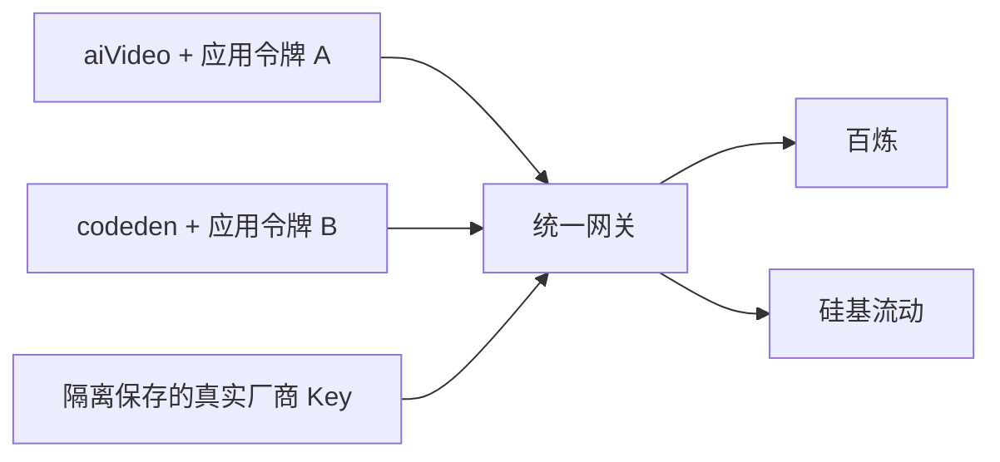

# aiVideo 与 codeden 统一模型网关方案（待实施）

## 当前决定

先在 aiVideo 跑通阿里云百炼 qwen-image-2.0 文生图。统一网关暂只记录方案，未创建新仓库或部署服务。

## 目标与分工

- 网关独立部署，保管百炼、硅基流动等真实厂商 Key，代应用调用模型，不向应用分发真实 Key。
- aiVideo、codeden 各自持有独立受限令牌，仅保存网关地址、令牌和模型名。
- 网关管理模型路由、应用权限、限流、额度及日志脱敏；管理员凭证不发给应用。
- 模型参数适配按厂商接口实现。文生图、图生图、带 mask 的局部重绘分别验收，不能仅通过配置宣称支持。

## Key 隔离边界

独立仓库不等于权限隔离。AI 必须无法读取网关的密钥文件、进程环境、数据库、日志及管理接口，也不能修改和运行持有 Key 的网关代码。

普通 Docker 部署不自动提供这种保护：有 Docker 管理权限的助手可能检查或进入容器。独立服务器、独立账户或严格沙箱可建立权限边界；挂载目录及管理凭证也必须隔离。

`.env`、`.gitignore`、日志脱敏只能降低误泄露风险。应用令牌即使无法读取真实 Key，仍能消耗授权额度，需要限额并能单独撤销。网关估算预算不能代替供应商侧的免费额度用尽停用设置。

## 候选实现

- [New API](https://github.com/QuantumNous/new-api)：渠道与令牌管理，评估具体 Qwen 生图/编辑协议兼容性后决定。
- [LiteLLM](https://github.com/BerriAI/litellm)：多模型路由与虚拟令牌，同样需验收图像接口。
- [Docker Sandboxes 凭证代理](https://docs.docker.com/ai/sandboxes/configuration/credentials/)：沙箱外注入鉴权，与普通 Docker 容器不同。
- 若现成网关不支持必要的生图参数，可保留应用 Provider 适配，先用隔离凭证代理转发；代理必须限制目标域名、路径和模型，不能任意转发带 Key 的请求。

## 实施顺序

1. 完成 aiVideo 直连百炼的单张文生图验证，记录实际结果。
2. 确定 codeden 的模型和协议需求，再评估共享网关。
3. 部署网关，人工配置真实 Key，为两个应用分别发受限令牌。
4. 将应用切换到网关并逐项验收，最后撤掉应用侧真实 Key。

当前生图配置见 [百炼生图接入](./百炼生图接入.md)。
